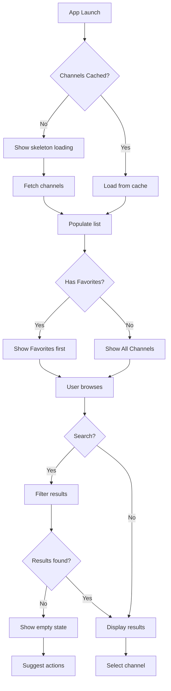
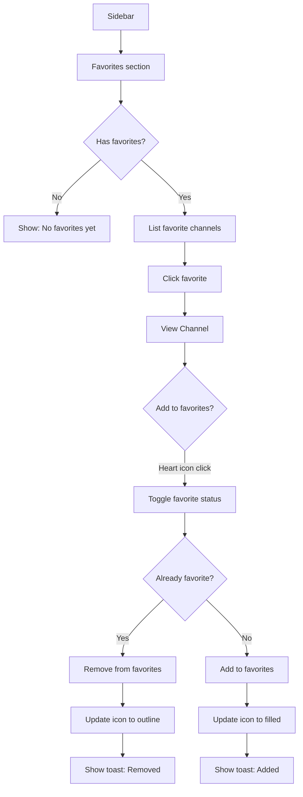

# TV Viewer Application - UX/UI Audit Report

**Date:** January 2025  
**Framework:** CustomTkinter (Python)  
**Design System:** Material Design Dark Theme  

---

## 1. Current UI Assessment

### 1.1 Component Hierarchy

```
MainWindow (CTk)
├── Sidebar (320px fixed width)
│   ├── Title Frame (App logo + version)
│   ├── Scan Progress Frame
│   │   ├── ScanAnimationWidget (pixel art canvas)
│   │   ├── Progress Label
│   │   ├── Progress Bar
│   │   └── Stats Label
│   ├── Search Entry
│   ├── Group By Selector (Category/Country)
│   ├── Media Type Selector (All/TV/Radio)
│   ├── Filter Toggles Frame
│   │   ├── Hide Checking Switch
│   │   └── Hide Failed Switch
│   ├── Category/Country Scrollable List
│   └── Action Buttons Frame
│       ├── Scan Button
│       ├── Edit Config Button
│       └── About Button
├── Main Content Area
│   ├── Content Header (title + count)
│   ├── Channel TreeView (sortable columns)
│   └── Preview Panel
│       ├── Thumbnail Container (128x72)
│       ├── Info Frame (name, url, status)
│       └── Play Button
└── Status Bar

PlayerWindow (CTkToplevel)
├── Video Frame (Canvas for VLC)
├── Controls Frame
│   ├── Play/Pause Button
│   ├── Stop Button
│   ├── Time Label
│   ├── Channel Label
│   ├── Cast Button (optional)
│   ├── VLC Button
│   ├── Fullscreen Button
│   └── Volume Controls (slider + mute)
└── Quality Info Frame
```

### 1.2 User Flows

**Channel Discovery Flow:**
1. App loads → Channels fetched from repository
2. User selects grouping (Category/Country)
3. User clicks category → Channel list populated
4. User scrolls/searches → Finds channel
5. User double-clicks → Player opens

**Playback Flow:**
1. Select channel from list
2. Preview panel shows thumbnail/info
3. Click "Play" or double-click
4. PlayerWindow opens with VLC
5. Controls available (play/pause/volume/fullscreen)

**Scan Flow:**
1. Click "Start Scan"
2. Animation shows progress
3. Channels validated in background
4. Status updates (working/failed counts)
5. List refreshes with status indicators

### 1.3 Current Design Strengths

- ✅ Consistent dark theme (#121212 background)
- ✅ Material Design color palette implemented
- ✅ Custom pixel art animation adds character
- ✅ Segmented buttons for grouping options
- ✅ Sortable column headers in channel list
- ✅ Keyboard shortcuts in player (space, f, m, Escape)
- ✅ Progress indicators during scan

---

## 2. Usability Issues

### 2.1 Critical Issues

| Issue | Description | Impact | Location |
|-------|-------------|--------|----------|
| **No Empty State** | When no channels match search/filter, blank list shown without guidance | Users confused if app is broken | `main_window.py` L695-736 |
| **No Error Recovery** | VLC initialization failure shows static error with no retry option | User cannot recover without restart | `player_window.py` L364-373 |
| **Fixed Sidebar Width** | 320px sidebar is not responsive, wastes space on large screens | Reduced content area | `main_window.py` L114-116 |

### 2.2 High Priority Issues

| Issue | Description | Impact | Location |
|-------|-------------|--------|----------|
| **TreeView Font Size** | 11px font size may be too small for media center / TV use | Accessibility barrier | `main_window.py` L439 |
| **No Loading Skeleton** | Channel list shows nothing while loading | Perceived slowness | `_update_channel_list` |
| **Missing Focus Indicators** | No visible focus ring on buttons/controls | Keyboard users disoriented | Throughout |
| **Truncated URL Display** | URL cut at 60 chars without tooltip | Information loss | `main_window.py` L857-858 |
| **No Confirmation Dialogs** | Stop casting/scan stops immediately | Accidental data loss | `player_window.py` |
| **Volume Slider No Labels** | 0-100 scale with no numeric display | Imprecise control | `player_window.py` L209-220 |

### 2.3 Medium Priority Issues

| Issue | Description | Impact | Location |
|-------|-------------|--------|----------|
| **Inconsistent Button Heights** | Mix of 32px, 36px, 40px buttons | Visual disharmony | Throughout |
| **No Hover States on TreeView** | Row highlight only on selection | Reduced discoverability | `main_window.py` L450-458 |
| **Progress Bar Redundancy** | Both CTkProgressBar and custom animation show same data | Visual clutter | `_create_scan_indicator` |
| **Status Icons as Unicode** | Using emoji (✓, ✗, ◌) instead of proper icons | Inconsistent rendering | L716-723 |
| **No Favorite/Bookmark System** | Cannot mark frequently-watched channels | Repeated navigation | Missing feature |
| **Player Window Size** | Uses config values, may not fit all screens | Window off-screen risk | `player_window.py` L121 |

### 2.4 Low Priority Issues

| Issue | Description | Impact | Location |
|-------|-------------|--------|----------|
| **Version Label Placement** | Version under title, could be in status bar | Minor clutter | `main_window.py` L135-141 |
| **About Dialog Not Modal Styled** | Dialog lacks distinct styling | Inconsistent feel | `_show_about` |
| **Hardcoded Icon Mapping** | Only ~30 categories/countries have icons | Missing icons for many | `_get_group_icon` L669-680 |

---

## 3. Accessibility Gaps (WCAG 2.1 Compliance)

### 3.1 Perceivable (WCAG 1.x)

| Criterion | Status | Issue | Recommendation |
|-----------|--------|-------|----------------|
| **1.1.1 Non-text Content** | ⚠️ Partial | Unicode emoji not reliably readable | Use proper icon fonts with `aria-label` equivalents |
| **1.3.1 Info and Relationships** | ❌ Fail | TreeView lacks semantic structure | Add role attributes where possible |
| **1.4.1 Use of Color** | ⚠️ Partial | Status relies on color (green/red/yellow) | Add text labels (already present ✓/✗/◌) |
| **1.4.3 Contrast (Minimum)** | ⚠️ Check | `TEXT_SECONDARY (#B0B0B0)` on `BG_DARK (#121212)` = 7.5:1 ✓ | Good for body text |
| **1.4.3 Contrast** | ⚠️ Check | `TEXT_DISABLED (#6B6B6B)` on `BG_DARK (#121212)` = 3.4:1 | Fails AA for normal text |
| **1.4.11 Non-text Contrast** | ⚠️ Partial | Progress bar track (#121212) vs. container may be low | Increase track visibility |

### 3.2 Operable (WCAG 2.x)

| Criterion | Status | Issue | Recommendation |
|-----------|--------|-------|----------------|
| **2.1.1 Keyboard** | ⚠️ Partial | Player has shortcuts; main window limited | Add Tab navigation, Enter to activate |
| **2.1.2 No Keyboard Trap** | ✅ Pass | Dialogs have close button, Escape works | — |
| **2.4.1 Bypass Blocks** | ❌ Fail | No skip-to-content for sidebar | Add keyboard shortcut to jump to channel list |
| **2.4.3 Focus Order** | ⚠️ Partial | Focus order follows visual layout | Document and test full flow |
| **2.4.7 Focus Visible** | ❌ Fail | CustomTkinter buttons lack visible focus ring | Custom styling needed |
| **2.5.5 Target Size** | ⚠️ Partial | 32px buttons meet minimum; some close together | Ensure 44px touch targets for TV remote use |

### 3.3 Understandable (WCAG 3.x)

| Criterion | Status | Issue | Recommendation |
|-----------|--------|-------|----------------|
| **3.1.1 Language of Page** | ❌ N/A | Desktop app, no HTML | Not applicable |
| **3.2.1 On Focus** | ✅ Pass | Focus doesn't trigger unexpected changes | — |
| **3.3.1 Error Identification** | ❌ Fail | VLC error doesn't identify specific cause | Show specific error message with solution |
| **3.3.3 Error Suggestion** | ❌ Fail | No suggestions for recovery | Add "Retry" button, troubleshooting tips |

### 3.4 Robust (WCAG 4.x)

| Criterion | Status | Issue | Recommendation |
|-----------|--------|-------|----------------|
| **4.1.2 Name, Role, Value** | ⚠️ Limited | Tkinter has limited accessibility API | Use accessible names where possible |

### 3.5 Accessibility Quick Wins

1. **Add keyboard shortcut hints** to buttons (e.g., "Play (Space)")
2. **Increase TEXT_DISABLED contrast** to at least #8A8A8A (4.5:1)
3. **Add visible focus indicators** using `highlightcolor` and `highlightthickness`
4. **Provide screen reader text** for status icons
5. **Add skip navigation** shortcut (Ctrl+1 = sidebar, Ctrl+2 = channel list)

---

## 4. Design System Analysis

### 4.1 Color Palette

```
Current Palette (from constants.py):
┌──────────────────────────────────────────────────────────────────┐
│ PRIMARY         #2196F3  ████  Blue 500                          │
│ PRIMARY_DARK    #1976D2  ████  Blue 700                          │
│ PRIMARY_LIGHT   #BBDEFB  ████  Blue 100                          │
│ ACCENT          #FF4081  ████  Pink A200                         │
│ ACCENT_DARK     #F50057  ████  Pink A400                         │
│ BG_DARK         #121212  ████  Material Dark Background          │
│ BG_CARD         #1E1E1E  ████  Elevated Surface                  │
│ BG_ELEVATED     #2D2D2D  ████  Elevated Surface +1               │
│ SURFACE         #1E1E1E  ████  (Duplicate of BG_CARD)            │
│ SURFACE_VARIANT #2D2D2D  ████  (Duplicate of BG_ELEVATED)        │
│ TEXT_PRIMARY    #FFFFFF  ████  High Emphasis                     │
│ TEXT_SECONDARY  #B0B0B0  ████  Medium Emphasis                   │
│ TEXT_DISABLED   #6B6B6B  ████  Disabled (LOW CONTRAST ⚠️)        │
│ SUCCESS         #4CAF50  ████  Green 500                         │
│ ERROR           #F44336  ████  Red 500                           │
│ WARNING         #FF9800  ████  Orange 500                        │
│ INFO            #2196F3  ████  Blue 500 (same as PRIMARY)        │
└──────────────────────────────────────────────────────────────────┘
```

**Issues Identified:**
- `SURFACE` and `SURFACE_VARIANT` are duplicates of `BG_CARD` and `BG_ELEVATED`
- Missing elevation system (Material Design uses overlay opacity)
- No semantic color tokens (e.g., `COLOR_CHANNEL_WORKING`, `COLOR_CHANNEL_OFFLINE`)
- `INFO` is identical to `PRIMARY`, reducing semantic distinction

**Recommended Additions:**
```python
# Elevation overlays (Material Design dark theme)
ELEVATION_01 = "#1F1F1F"  # 5% white overlay
ELEVATION_02 = "#232323"  # 7% white overlay
ELEVATION_03 = "#252525"  # 8% white overlay
ELEVATION_04 = "#272727"  # 9% white overlay
ELEVATION_06 = "#2C2C2C"  # 11% white overlay

# Semantic tokens
CHANNEL_WORKING = SUCCESS
CHANNEL_OFFLINE = ERROR
CHANNEL_CHECKING = WARNING
SCAN_ACTIVE = PRIMARY
```

### 4.2 Typography

```
Current Font Usage:
┌────────────────────────────────────────────────────────────┐
│ Element              Font                    Size  Weight  │
├────────────────────────────────────────────────────────────┤
│ App Title            CTkFont                 24    bold    │
│ Section Header       CTkFont                 14-16 bold    │
│ Body Text            CTkFont                 12-13 normal  │
│ Small Text           CTkFont                 11    normal  │
│ TreeView             Segoe UI                11    normal  │
│ TreeView Header      Segoe UI                11    bold    │
│ Status Text          CTkFont                 11    normal  │
│ Button Text          CTkFont                 11-14 normal  │
│ Animation Stats      Consolas                8-10  bold    │
└────────────────────────────────────────────────────────────┘
```

**Issues:**
- Inconsistent font families (CTkFont vs. 'Segoe UI' vs. 'Consolas')
- No type scale system (arbitrary sizes: 8, 9, 10, 11, 12, 13, 14, 16, 20, 24)
- Scan animation uses monospace font inconsistently

**Recommended Type Scale (Material Design):**
```python
FONT_DISPLAY_LARGE = 57   # Not used in this app
FONT_HEADLINE_LARGE = 32  # App name on splash
FONT_HEADLINE_MEDIUM = 24 # Current app title ✓
FONT_HEADLINE_SMALL = 20  # Section headers
FONT_TITLE_LARGE = 18     # Panel titles
FONT_TITLE_MEDIUM = 16    # Subheadings
FONT_BODY_LARGE = 14      # Primary body text
FONT_BODY_MEDIUM = 13     # Secondary body
FONT_BODY_SMALL = 12      # Captions
FONT_LABEL_LARGE = 14     # Button text
FONT_LABEL_MEDIUM = 12    # Switch labels
FONT_LABEL_SMALL = 11     # Status text
```

### 4.3 Spacing System

**Current Spacing (observed):**
- Inconsistent padding: `padx=5`, `padx=10`, `padx=15`, `padx=20`
- Inconsistent margins: `pady=2`, `pady=5`, `pady=8`, `pady=10`, `pady=14`, `pady=15`
- No documented spacing scale

**Recommended 4px Grid System:**
```python
SPACE_0 = 0
SPACE_1 = 4    # Tight spacing
SPACE_2 = 8    # Default component spacing
SPACE_3 = 12   # Medium spacing
SPACE_4 = 16   # Section spacing
SPACE_5 = 20   # Large section spacing
SPACE_6 = 24   # Page margins
SPACE_8 = 32   # Major sections
SPACE_10 = 40  # Hero spacing
```

### 4.4 Component Sizing

```
Current Button Sizes:
┌──────────────────────────────────────────────────┐
│ Component              Width   Height  Radius    │
├──────────────────────────────────────────────────┤
│ Play/Pause (Player)    50      40      20        │
│ Stop Button            50      40      20        │
│ Mute Button            40      32      16        │
│ Fullscreen Button      40      32      16        │
│ VLC Button             50      32      16        │
│ Cast Button            40      32      16        │
│ Scan Button (Sidebar)  fill    36      18        │
│ Settings Button        fill    36      18        │
│ About Button           fill    36      18        │
│ Search Entry           fill    40      20        │
└──────────────────────────────────────────────────┘
```

**Issues:**
- No consistent button size tokens
- Corner radius varies (16, 18, 20)
- Icon-only buttons (40x32) may be too small for touch/TV

**Recommended Standard Sizes:**
```python
# Button sizes
BTN_SMALL = (32, 32)    # Icon-only buttons
BTN_MEDIUM = (auto, 40) # Standard buttons
BTN_LARGE = (auto, 48)  # Primary actions

# Corner radius
RADIUS_SMALL = 8
RADIUS_MEDIUM = 12
RADIUS_LARGE = 16
RADIUS_FULL = 9999  # Pill shape
```

---

## 5. Recommended Improvements (Prioritized)

### 5.1 Phase 1: Critical Fixes (1-2 weeks)

| # | Improvement | Effort | Impact |
|---|-------------|--------|--------|
| 1 | **Add Empty State Components** | Low | High |
|   | Create `EmptyState` widget with icon, title, description, and action button |
| 2 | **Add Error Recovery UI** | Medium | High |
|   | VLC error screen with "Retry", "Open Settings", "Install VLC" buttons |
| 3 | **Improve Focus Visibility** | Low | High |
|   | Add 2px focus ring to all interactive elements |
| 4 | **Fix Contrast Issues** | Low | Medium |
|   | Update `TEXT_DISABLED` to #8A8A8A |

### 5.2 Phase 2: High-Impact Improvements (2-4 weeks)

| # | Improvement | Effort | Impact |
|---|-------------|--------|--------|
| 5 | **Add Favorites System** | Medium | High |
|   | Heart icon on channels, "Favorites" pseudo-category at top |
| 6 | **Implement Loading Skeletons** | Medium | Medium |
|   | Shimmer animation in channel list while loading |
| 7 | **Add Keyboard Navigation** | Medium | High |
|   | Full Tab order, Ctrl+F for search, Ctrl+P to play |
| 8 | **Responsive Sidebar** | Medium | Medium |
|   | Collapsible to 60px icon-only mode on smaller windows |
| 9 | **Add Tooltips** | Low | Medium |
|   | URL tooltip, button labels, status explanations |

### 5.3 Phase 3: Polish & Enhancement (4-8 weeks)

| # | Improvement | Effort | Impact |
|---|-------------|--------|--------|
| 10 | **Unified Design Tokens** | High | High |
|    | Create comprehensive token system in constants.py |
| 11 | **Add Channel Context Menu** | Medium | Medium |
|    | Right-click: Play, Copy URL, Add to Favorites, Report Issue |
| 12 | **Mini Player Mode** | High | Medium |
|    | Picture-in-picture style floating player |
| 13 | **Recently Watched List** | Medium | Medium |
|    | Track last 10 channels, show in sidebar |
| 14 | **Settings Panel** | High | Medium |
|    | In-app settings (theme, font size, default quality) |
| 15 | **Onboarding Flow** | Medium | Low |
|    | First-run wizard explaining features |

### 5.4 Mockup Descriptions

#### Empty State Component
```
┌─────────────────────────────────────────────────┐
│                                                 │
│              ┌─────────────────┐                │
│              │   📺  (large)   │                │
│              └─────────────────┘                │
│                                                 │
│           No channels found                     │
│                                                 │
│   Try a different search term or check          │
│   your filters. You can also browse all         │
│   channels.                                     │
│                                                 │
│         [ Show All Channels ]                   │
│                                                 │
└─────────────────────────────────────────────────┘
```

#### Error Recovery Panel
```
┌─────────────────────────────────────────────────┐
│                                                 │
│              ⚠️ Playback Error                  │
│                                                 │
│   VLC media player could not be initialized.    │
│                                                 │
│   Error: libvlc.dll not found                   │
│                                                 │
│   Solutions:                                    │
│   • Install VLC from videolan.org               │
│   • Ensure VLC is 64-bit (for Python 64-bit)    │
│   • Restart the application                     │
│                                                 │
│   [ Retry ]  [ Install VLC ]  [ Open External ] │
│                                                 │
└─────────────────────────────────────────────────┘
```

#### Favorites Quick Access
```
Sidebar addition (above Categories):
┌─────────────────────────────────────────────────┐
│ ⭐ Favorites                              (5)   │
├─────────────────────────────────────────────────┤
│ 📺 CNN International                         ❤️ │
│ 📺 BBC World News                            ❤️ │
│ 📺 Al Jazeera English                        ❤️ │
│ ─────────────────────────────────────────────── │
│ 📂 Categories                                   │
└─────────────────────────────────────────────────┘
```

---

## 6. Proposed User Flows

### 6.1 Channel Discovery (Improved)



### 6.2 Playback Flow (Improved)

```mermaid
graph TD
    A[Select Channel] --> B[Update Preview Panel]
    B --> C{Thumbnail exists?}
    C -->|Yes| D[Show thumbnail]
    C -->|No| E[Show placeholder]
    E --> F{Channel working?}
    F -->|Yes| G[Capture thumbnail async]
    F -->|No| H[Show "offline" image]
    G --> D
    
    B --> I[User clicks Play]
    I --> J{VLC available?}
    J -->|No| K[Show error with recovery options]
    K --> L{User action}
    L -->|Retry| J
    L -->|External| M[Open in system player]
    L -->|Cancel| N[Return to main]
    
    J -->|Yes| O[Initialize player]
    O --> P{Stream loads?}
    P -->|No| Q[Show buffering indicator]
    Q --> R{Timeout?}
    R -->|Yes| S[Show error: Stream unavailable]
    R -->|No| Q
    P -->|Yes| T[Start playback]
    T --> U[Show controls]
```

### 6.3 Favorites Management Flow (New)



### 6.4 Keyboard Navigation Flow (New)

```
Main Window Shortcuts:
┌─────────────────────────────────────────────────────────────┐
│ Shortcut        Action                                      │
├─────────────────────────────────────────────────────────────┤
│ Tab             Move focus to next element                  │
│ Shift+Tab       Move focus to previous element              │
│ Enter           Activate focused button / Play channel      │
│ Escape          Close dialog / Exit fullscreen              │
│ Ctrl+F          Focus search box                            │
│ Ctrl+1          Jump to sidebar                             │
│ Ctrl+2          Jump to channel list                        │
│ Ctrl+P          Play selected channel                       │
│ Ctrl+S          Start/Stop scan                             │
│ ↑/↓             Navigate channel list                       │
│ F               Add/Remove from favorites (when selected)   │
│ Delete          Remove from favorites (in favorites view)   │
└─────────────────────────────────────────────────────────────┘

Player Window Shortcuts (existing + additions):
┌─────────────────────────────────────────────────────────────┐
│ Space           Play/Pause ✓                                │
│ F               Toggle fullscreen ✓                         │
│ M               Toggle mute ✓                               │
│ Escape          Exit fullscreen ✓                           │
│ ↑/↓             Volume up/down (NEW)                        │
│ ←/→             Seek (if DVR available) (NEW)               │
│ C               Show cast menu (NEW)                        │
│ I               Show stream info (NEW)                      │
│ Ctrl+Q          Close player (NEW)                          │
└─────────────────────────────────────────────────────────────┘
```

---

## 7. Component Specifications

### 7.1 EmptyState Component

**Purpose:** Display helpful message when list is empty

**Props:**
| Property | Type | Default | Description |
|----------|------|---------|-------------|
| icon | str | "📭" | Large emoji or icon path |
| title | str | required | Bold heading text |
| description | str | "" | Secondary explanation text |
| action_text | str | None | Button label (if actionable) |
| action_callback | callable | None | Button click handler |

**Visual Spec:**
```
┌────────────────────────────────────────────┐
│ fg_color: transparent                      │
│                                            │
│   Icon: 48px (emoji or CTkImage)           │
│   Margin-bottom: 16px                      │
│                                            │
│   Title: CTkFont(size=16, weight="bold")   │
│   Color: TEXT_PRIMARY                      │
│   Margin-bottom: 8px                       │
│                                            │
│   Description: CTkFont(size=13)            │
│   Color: TEXT_SECONDARY                    │
│   Max-width: 280px                         │
│   Text-align: center                       │
│   Margin-bottom: 16px                      │
│                                            │
│   Button (if action_text):                 │
│     Height: 40px                           │
│     Corner-radius: 20px                    │
│     fg_color: PRIMARY                      │
│                                            │
└────────────────────────────────────────────┘
```

**Implementation:**
```python
class EmptyState(ctk.CTkFrame):
    def __init__(self, parent, icon="📭", title="No items", 
                 description="", action_text=None, action_callback=None):
        super().__init__(parent, fg_color="transparent")
        
        # Icon
        ctk.CTkLabel(self, text=icon, 
                     font=ctk.CTkFont(size=48)).pack(pady=(20, 16))
        
        # Title
        ctk.CTkLabel(self, text=title,
                     font=ctk.CTkFont(size=16, weight="bold"),
                     text_color=MaterialColors.TEXT_PRIMARY).pack()
        
        # Description
        if description:
            ctk.CTkLabel(self, text=description,
                         font=ctk.CTkFont(size=13),
                         text_color=MaterialColors.TEXT_SECONDARY,
                         wraplength=280).pack(pady=(8, 16))
        
        # Action button
        if action_text and action_callback:
            ctk.CTkButton(self, text=action_text,
                          command=action_callback,
                          height=40, corner_radius=20,
                          fg_color=MaterialColors.PRIMARY).pack()
```

---

### 7.2 FavoriteButton Component

**Purpose:** Toggle favorite status for channels

**Props:**
| Property | Type | Default | Description |
|----------|------|---------|-------------|
| is_favorite | bool | False | Current favorite state |
| on_toggle | callable | None | Callback(new_state: bool) |
| size | int | 24 | Button size in pixels |

**States:**
```
Default (unfilled):    ○ (outline heart)   Color: TEXT_SECONDARY
Hover:                 ○ (outline heart)   Color: ACCENT
Active (filled):       ● (filled heart)    Color: ACCENT
Hover (active):        ● (filled heart)    Color: ACCENT_DARK
```

**Implementation:**
```python
class FavoriteButton(ctk.CTkButton):
    def __init__(self, parent, is_favorite=False, on_toggle=None, size=24):
        self.is_favorite = is_favorite
        self.on_toggle = on_toggle
        
        super().__init__(
            parent,
            text="♥" if is_favorite else "♡",
            width=size,
            height=size,
            corner_radius=size // 2,
            fg_color="transparent",
            hover_color=MaterialColors.SURFACE_VARIANT,
            text_color=MaterialColors.ACCENT if is_favorite else MaterialColors.TEXT_SECONDARY,
            command=self._toggle,
            font=ctk.CTkFont(size=size - 8)
        )
    
    def _toggle(self):
        self.is_favorite = not self.is_favorite
        self.configure(
            text="♥" if self.is_favorite else "♡",
            text_color=MaterialColors.ACCENT if self.is_favorite else MaterialColors.TEXT_SECONDARY
        )
        if self.on_toggle:
            self.on_toggle(self.is_favorite)
```

---

### 7.3 LoadingSkeleton Component

**Purpose:** Show placeholder content while loading

**Props:**
| Property | Type | Default | Description |
|----------|------|---------|-------------|
| rows | int | 5 | Number of skeleton rows |
| animated | bool | True | Enable shimmer animation |

**Visual Spec:**
```
┌────────────────────────────────────────────────────────────┐
│ ████████████████████████░░░░░░░░░░░░░░░░░░░░░░░░░░░░░░░░░ │ Row 1
│ ████████████████░░░░░░░░░░░░░░░░░░░░░░░░░░░░░░░░░░░░░░░░░ │ Row 2
│ ██████████████████████████░░░░░░░░░░░░░░░░░░░░░░░░░░░░░░░ │ Row 3
│ ████████████░░░░░░░░░░░░░░░░░░░░░░░░░░░░░░░░░░░░░░░░░░░░░ │ Row 4
│ ██████████████████░░░░░░░░░░░░░░░░░░░░░░░░░░░░░░░░░░░░░░░ │ Row 5
└────────────────────────────────────────────────────────────┘

Animation: Shimmer gradient moves left-to-right over 1.5s
Colors:
  - Base: BG_ELEVATED (#2D2D2D)
  - Shimmer: SURFACE_VARIANT (#3D3D3D)
```

---

### 7.4 ToastNotification Component

**Purpose:** Show temporary feedback messages

**Props:**
| Property | Type | Default | Description |
|----------|------|---------|-------------|
| message | str | required | Toast message text |
| type | str | "info" | "success" / "error" / "warning" / "info" |
| duration | int | 3000 | Auto-dismiss time in ms |
| position | str | "bottom" | "top" / "bottom" |

**Visual Spec:**
```
Position: 20px from bottom, centered horizontally
Size: Auto width (min 200px, max 400px), 48px height
Corner radius: 24px (pill shape)
Shadow: Elevation 6

Types:
┌──────────────────────────────────────────┐
│ ✓  Added to favorites     │ SUCCESS     │
│    bg: #4CAF50, text: white              │
├──────────────────────────────────────────┤
│ ✗  Failed to load         │ ERROR       │
│    bg: #F44336, text: white              │
├──────────────────────────────────────────┤
│ ⚠  Connection slow        │ WARNING     │
│    bg: #FF9800, text: black              │
├──────────────────────────────────────────┤
│ ℹ  Scan started           │ INFO        │
│    bg: #2196F3, text: white              │
└──────────────────────────────────────────┘

Animation:
  - Enter: Slide up + fade in (200ms ease-out)
  - Exit: Fade out (150ms ease-in)
```

---

### 7.5 VolumeControl Component (Improved)

**Purpose:** Unified volume control with visual feedback

**Current Issues:**
- No numeric display
- Mute button separate from slider
- No keyboard support

**Improved Spec:**
```
┌──────────────────────────────────────────────────────────────┐
│  🔊  ━━━━━━━━━━●━━━━━━━━━━  75%                              │
│                                                              │
│  States:                                                     │
│  - Muted:    🔇 (icon changes, slider grayed)               │
│  - Low:      🔈 (0-33%)                                     │
│  - Medium:   🔉 (34-66%)                                    │
│  - High:     🔊 (67-100%)                                   │
│                                                              │
│  Interactions:                                               │
│  - Click icon: Toggle mute                                   │
│  - Drag slider: Adjust volume                                │
│  - Scroll on slider: Fine adjust (±5%)                       │
│  - ↑/↓ keys when focused: ±5%                               │
│                                                              │
│  Dimensions:                                                 │
│  - Total width: 180px                                        │
│  - Icon: 24x24                                              │
│  - Slider: 120px                                            │
│  - Label: 36px                                              │
└──────────────────────────────────────────────────────────────┘
```

---

### 7.6 Updated Constants (Recommended)

```python
"""Shared UI constants for TV Viewer - Updated Design Tokens."""


class MaterialColors:
    """Material Design 3 color palette for dark theme."""
    
    # Primary colors
    PRIMARY = "#2196F3"
    PRIMARY_DARK = "#1976D2"
    PRIMARY_LIGHT = "#BBDEFB"
    PRIMARY_CONTAINER = "#004A77"
    ON_PRIMARY = "#FFFFFF"
    ON_PRIMARY_CONTAINER = "#D1E4FF"
    
    # Secondary/Accent colors
    ACCENT = "#FF4081"
    ACCENT_DARK = "#F50057"
    ACCENT_CONTAINER = "#8C0048"
    ON_ACCENT = "#FFFFFF"
    
    # Background colors (elevation system)
    BG_DARK = "#121212"         # Level 0
    BG_CARD = "#1E1E1E"         # Level 1 (5% overlay)
    BG_ELEVATED = "#232323"     # Level 2 (7% overlay)
    BG_ELEVATED_2 = "#272727"   # Level 3 (9% overlay)
    BG_ELEVATED_3 = "#2C2C2C"   # Level 4 (11% overlay)
    
    # Surface (semantic aliases)
    SURFACE = BG_CARD
    SURFACE_VARIANT = BG_ELEVATED
    SURFACE_CONTAINER = "#1D1B20"
    
    # Text colors
    TEXT_PRIMARY = "#FFFFFF"     # 100% opacity
    TEXT_SECONDARY = "#B0B0B0"   # 70% opacity
    TEXT_DISABLED = "#8A8A8A"    # UPDATED: 55% for 4.5:1 contrast
    TEXT_HINT = "#757575"        # 45% opacity
    
    # Status colors (semantic)
    SUCCESS = "#4CAF50"
    ERROR = "#F44336"
    WARNING = "#FF9800"
    INFO = "#03A9F4"             # UPDATED: Distinct from PRIMARY
    
    # Channel status (semantic tokens)
    CHANNEL_WORKING = SUCCESS
    CHANNEL_OFFLINE = ERROR
    CHANNEL_CHECKING = WARNING
    CHANNEL_UNKNOWN = TEXT_DISABLED
    
    # Interactive states
    RIPPLE = "rgba(255, 255, 255, 0.12)"
    FOCUS_RING = PRIMARY
    HOVER_OVERLAY = "rgba(255, 255, 255, 0.08)"


class Spacing:
    """Spacing scale based on 4px grid."""
    XS = 4
    SM = 8
    MD = 12
    LG = 16
    XL = 20
    XXL = 24
    XXXL = 32


class Typography:
    """Typography scale."""
    DISPLAY = 32
    HEADLINE = 24
    TITLE_LARGE = 20
    TITLE = 16
    BODY_LARGE = 14
    BODY = 13
    BODY_SMALL = 12
    LABEL = 11
    CAPTION = 10


class Sizing:
    """Component sizing tokens."""
    BUTTON_HEIGHT_SM = 32
    BUTTON_HEIGHT_MD = 40
    BUTTON_HEIGHT_LG = 48
    
    ICON_SM = 16
    ICON_MD = 24
    ICON_LG = 32
    
    RADIUS_SM = 8
    RADIUS_MD = 12
    RADIUS_LG = 16
    RADIUS_FULL = 9999
    
    SIDEBAR_WIDTH = 320
    SIDEBAR_COLLAPSED = 60
    THUMBNAIL_WIDTH = 128
    THUMBNAIL_HEIGHT = 72
```

---

## 8. Summary & Next Steps

### Key Findings

1. **Strong Foundation:** Material Design color system and dark theme are well-implemented
2. **Main Gaps:** Accessibility (keyboard nav, focus indicators), empty states, error recovery
3. **Quick Wins:** Contrast fixes, focus rings, tooltips can be done in days
4. **Biggest Impact:** Favorites system and keyboard navigation would significantly improve UX

### Recommended Priority

```
Week 1-2:  Empty states, error recovery, contrast fixes, focus visibility
Week 3-4:  Favorites system, keyboard navigation, loading skeletons
Week 5-8:  Design token unification, tooltips, responsive sidebar
Future:    Mini player, settings panel, onboarding
```

### Files to Modify

| File | Changes |
|------|---------|
| `ui/constants.py` | Add design tokens (spacing, typography, sizing) |
| `ui/main_window.py` | Add EmptyState, FavoriteButton, keyboard handlers |
| `ui/player_window.py` | Improve error UI, add VolumeControl, keyboard hints |
| `ui/components/` (new) | Create reusable component library |

---

*End of UX Audit Report*
