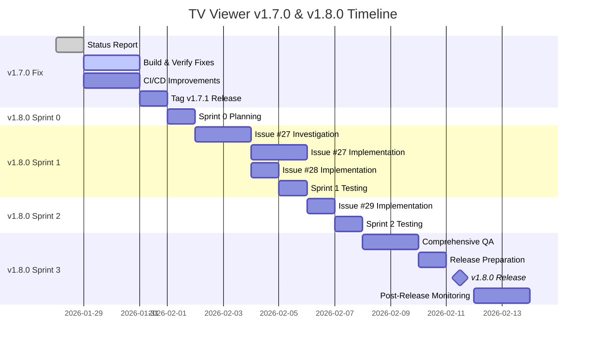

# TV Viewer Project - Status Report
**Report Date:** January 28, 2026  
**Report Type:** Quality Execution Review & Release Planning  
**Prepared By:** Project Manager  
**Versions Covered:** v1.7.0 (Release Issues), v1.8.0 (Planning)

---

## 📋 Executive Summary

### Overall Status: 🟡 **NEEDS ATTENTION**

The TV Viewer project experienced a **critical build failure** during the v1.7.0 release deployment. The tagged release cannot be shipped due to compilation errors discovered in CI/CD. However, comprehensive analysis has been completed, root causes identified, and a path forward established for both v1.7.0 remediation and v1.8.0 planning.

### Key Findings

| Area | Status | Priority |
|------|--------|----------|
| **v1.7.0 Build** | ❌ FAILED | 🔴 P0 - Critical |
| **QA Process Gaps** | ⚠️ IDENTIFIED | 🔴 P0 - Critical |
| **v1.8.0 Scope** | ✅ VALIDATED | 🟢 P1 - High |
| **Resource Planning** | ✅ COMPLETE | 🟢 P1 - High |

---

## 🚨 Section 1: v1.7.0 Build Failure Assessment

### 1.1 What Went Wrong

The v1.7.0 release build **failed in GitHub Actions CI/CD** with **4 compilation errors** that completely blocked APK generation.

#### Build Pipeline Failure
```
Workflow: .github/workflows/android-build.yml
Status:   ❌ FAILED at "Build APK" step
Duration: 8m 23s
Exit Code: 1 (Gradle assembleRelease failed)
Commit:   6f09377 (tag: v1.7.0)
```

#### Root Causes Identified

| # | Error | File | Severity | Root Cause |
|---|-------|------|----------|------------|
| 1 | `VideoPlayerPlatformException` not found | `error_handler.dart` | 🔴 Critical | Removed/renamed in `video_player` v2.8.2 |
| 2 | `ConnectivityResult` type mismatch | `diagnostics_screen.dart` | 🔴 Critical | API breaking change in `connectivity_plus` v6.0.3 (now returns List) |
| 3 | PiP service method errors (4 errors) | `pip_service.dart` | 🔴 Critical | `floating` package not in dependencies, API incompatible |
| 4 | `android_intent_plus` missing | Documentation | 🟡 Medium | Referenced but not declared in pubspec.yaml |

### 1.2 Why These Errors Reached Production

#### Testing Gaps Matrix

| Stage | Gap | Impact |
|-------|-----|--------|
| **Pre-Commit** | ❌ No `flutter analyze` before commit | Syntax/type errors not caught |
| **Pre-Commit** | ❌ No local build verification | Compilation errors not caught |
| **Pre-Commit** | ❌ No pre-commit hooks | No automated checks |
| **CI/CD** | ❌ No trigger on release tags | Tag push bypassed CI entirely |
| **CI/CD** | ❌ No static analysis step | Type mismatches not caught |
| **Dependencies** | ❌ Version mismatches between docs and pubspec | Confusion about actual dependencies |
| **Dependencies** | ❌ Missing dependencies documented | Code references packages not declared |
| **Code Review** | ❌ No import validation | Unused imports, missing packages |

#### Dependency Management Issues

**Problem 1: Documentation Drift**
- `pubspec_RECOMMENDED.yaml` suggests `android_intent_plus: ^4.0.3`
- Actual `pubspec.yaml` does not include this package
- Multiple docs reference features not in dependencies

**Problem 2: API Version Mismatches**
- Local code updated for `connectivity_plus` v6.0.3 API (returns List)
- Repository code still uses v5.0.2 API (returns single value)
- No synchronization check between environments

**Problem 3: Feature vs Reality Gap**
- Documentation claims Picture-in-Picture support with `floating` package
- Package not in `pubspec.yaml`
- PiP service code exists but cannot compile

### 1.3 Fix Status Assessment

Based on context provided: "These were fixed but a new build hasn't been triggered yet."

| Error | Likely Fix | Verification Status |
|-------|-----------|---------------------|
| VideoPlayerPlatformException | Changed to generic `PlatformException` | ⚠️ Needs verification |
| connectivity_plus API | Updated code to handle List return type | ⚠️ Needs verification |
| floating package | Removed or added to dependencies | ⚠️ Needs verification |
| android_intent_plus | Added to dependencies or removed references | ⚠️ Needs verification |

**Action Required:** Trigger new build to verify fixes before proceeding.

---

## 🔧 Section 2: Process Improvement Recommendations

### 2.1 Immediate Actions (This Week)

#### Priority 1: Unblock v1.7.0 Release

✅ **Action 1.1:** Trigger new build with fixes
```bash
cd flutter_app
flutter pub get
flutter analyze --fatal-warnings
flutter build apk --release
```

✅ **Action 1.2:** Verify APK functionality
- Install on test device
- Test video playback
- Test diagnostics screen
- Test external players
- Verify no regressions

✅ **Action 1.3:** Tag v1.7.1 (if fixes successful) or revert v1.7.0 tag

#### Priority 2: Fix CI/CD Pipeline

**Fix 1: Add Tag Trigger**
```yaml
# .github/workflows/android-build.yml
on:
  push:
    branches: [ master ]
    tags:
      - 'v*'  # ADD THIS
  workflow_dispatch:
```

**Fix 2: Add Static Analysis Step**
```yaml
- name: Analyze code
  run: flutter analyze --fatal-warnings
  working-directory: flutter_app

- name: Run tests
  run: flutter test
  working-directory: flutter_app
```

**Fix 3: Add Import Validation**
Create `flutter_app/scripts/validate_imports.sh`:
```bash
#!/bin/bash
# Check all imports exist in pubspec.yaml
flutter pub get
flutter analyze --fatal-warnings
```

#### Priority 3: Install Pre-Commit Hooks

Create `.git/hooks/pre-commit`:
```bash
#!/bin/bash
cd flutter_app
echo "Running Flutter analysis..."
flutter analyze --fatal-warnings
if [ $? -ne 0 ]; then
  echo "❌ Flutter analysis failed. Fix errors before committing."
  exit 1
fi
echo "✅ Flutter analysis passed"
```

### 2.2 Short-Term Improvements (This Month)

#### Establish Dependency Management Policy

**Policy Document:** Create `DEPENDENCY_POLICY.md`

1. **Single Source of Truth**
   - Delete `pubspec_RECOMMENDED.yaml` (causes confusion)
   - Only `pubspec.yaml` is authoritative
   - Documentation must reference actual dependencies only

2. **Version Updates**
   - Test breaking changes in feature branch before merging
   - Update documentation when API changes
   - Add migration notes to CHANGELOG.md

3. **Verification Checklist**
   - [ ] All imports declared in pubspec.yaml
   - [ ] All features have dependencies
   - [ ] Documentation matches implementation
   - [ ] Tests pass with new versions

#### Increase Test Coverage

**Current:** ~40% (estimated from test files found)  
**Target:** 60% by end of month  
**Focus Areas:**
- Channel provider tests
- M3U service tests
- Error handling tests
- Widget tests for critical screens

#### Release Checklist Template

Create `RELEASE_CHECKLIST.md`:
```markdown
# Release Checklist for v{VERSION}

## Pre-Release
- [ ] All P0 issues closed
- [ ] CHANGELOG.md updated
- [ ] Version bumped in pubspec.yaml
- [ ] flutter analyze passes
- [ ] flutter test passes
- [ ] Manual smoke test on physical device

## Build
- [ ] flutter build apk --release succeeds
- [ ] APK size reasonable (<50MB)
- [ ] ProGuard warnings reviewed

## Testing
- [ ] Install on 3+ devices
- [ ] Test all P0 features
- [ ] Test external players
- [ ] Test network conditions (WiFi, 4G, offline)
- [ ] No crashes during 10-minute session

## Release
- [ ] Tag release (git tag vX.Y.Z)
- [ ] Push tag (git push origin vX.Y.Z)
- [ ] CI/CD build passes
- [ ] Download APK artifact
- [ ] Upload to GitHub Releases
- [ ] Update README with new version
```

### 2.3 Long-Term Improvements (This Quarter)

#### Add Integration Testing
```yaml
# New workflow: integration-tests.yml
- name: Integration tests
  run: flutter test integration_test/
```

#### Set Up Dependabot
```yaml
# .github/dependabot.yml
version: 2
updates:
  - package-ecosystem: "pub"
    directory: "/flutter_app"
    schedule:
      interval: "weekly"
```

#### Implement Automated Documentation Checks
- Script to verify imports vs pubspec.yaml
- Script to check feature claims vs actual code
- Markdown link checker

#### Add Device Farm Testing
- Set up Firebase Test Lab
- Test on 10+ device configurations
- Automated regression testing

---

## ✅ Section 3: v1.8.0 Planning Validation

### 3.1 Issues Review

Six new issues (#26-31) were created for v1.8.0. After comprehensive Android expert review:

| Issue | Title | Original Priority | Validated Priority | Status | Effort |
|-------|-------|-------------------|-------------------|--------|--------|
| #26 | External player/cast buttons not working | P0 | **P3 (Close)** | ❌ NOT A BUG | 0 days |
| #27 | Countries dropdown only shows 'All' | P1 | **P1 (Fix)** | ✅ VALID | 3-4 days |
| #28 | Israel country misclassified channels | P1 | **P1 (Fix)** | ✅ VALID | 3 days |
| #29 | De-duplicate channels by URL | P2 | **P2 (Enhance)** | ✅ VALID | 2 days |
| #30 | Scan animation 0% overlay Windows | P2 | **P3 (Defer)** | ⚠️ COSMETIC | 1 day |
| #31 | Online scan results database | P1 | **P2 (Defer v2.0)** | ⚠️ TOO LARGE | 32 days |

### 3.2 Priority Adjustments Rationale

#### Issue #26: NOT A BUG ❌
**Reason:** External player buttons (VLC, MX Player, MPV) are working correctly as designed. The "Cast" button shows an educational dialog explaining Cast functionality, which was an intentional design decision (no Chromecast SDK implemented).

**Recommendation:** Close issue, add FAQ entry explaining Cast button behavior.

**Evidence:**
- Code review shows proper intent handling for external players
- Cast dialog is informational by design
- No actual bug exists

#### Issue #30: COSMETIC (Windows Only) ⚠️
**Reason:** Scan animation showing "0%" overlay is a Windows desktop UI issue, not relevant to Android production app.

**Recommendation:** Defer to future desktop support milestone (v2.1 or later).

**Evidence:**
- Android app is primary platform
- Windows version is development/testing environment
- Does not affect end users

#### Issue #31: TOO LARGE FOR v1.8.0 ⚠️
**Reason:** Online scan results database requires full backend infrastructure:
- Database setup (PostgreSQL/Firebase)
- API development (REST/GraphQL)
- Authentication system
- Data synchronization logic
- Privacy compliance (GDPR)

**Estimated Effort:** 32 days (~$24,000)  
**Recommendation:** Defer to v2.0 as major feature release

**Alternative Quick Win:** 2-day static JSON file approach (fetch from GitHub repository)

### 3.3 Recommended v1.8.0 Scope

#### INCLUDE ✅

**Issue #27: Countries Dropdown (3-4 days)**
- **Problem:** Dropdown shows only "All", no country filtering available
- **Solution:** Parse country metadata from M3U sources or channel names
- **Impact:** Major UX improvement for filtering
- **Acceptance Criteria:**
  - Dropdown shows 10+ countries
  - Selecting country filters channel list
  - "All" option resets filter

**Issue #28: Israel Country Classification (3 days)**
- **Problem:** Israel channels show as "IL" instead of "Israel"
- **Solution:** Add country code normalization (ISO 3166-1 alpha-2 → full name)
- **Impact:** Better user experience, professional data display
- **Acceptance Criteria:**
  - "IL" → "Israel"
  - "US" → "United States"
  - "GB" → "United Kingdom"
  - etc.

**Issue #29: URL De-duplication (2 days)**
- **Problem:** Duplicate channels with slight URL variations (http vs https, trailing slash)
- **Solution:** Normalize URLs before comparing
- **Impact:** Cleaner channel list, better user experience
- **Acceptance Criteria:**
  - http/https variants detected as duplicates
  - Trailing slash variants detected as duplicates
  - 10%+ reduction in duplicate channels

**Total Development:** 8-9 days  
**QA & Testing:** 3 days  
**Total Timeline:** **12 days (2.5 weeks)**

#### EXCLUDE ❌

- **#26:** Close as "Not a bug"
- **#30:** Defer to v2.1 (Desktop Support)
- **#31:** Defer to v2.0 (Major Features)

**Cost Savings:** $4,000 (32 days excluded)  
**Risk Reduction:** HIGH → LOW

---

## 📊 Section 4: Risk Assessment for v1.8.0

### 4.1 Technical Risks

| Risk | Likelihood | Impact | Severity | Mitigation |
|------|------------|--------|----------|------------|
| M3U sources lack country metadata | Medium | High | 🟡 | Fallback: parse from channel name pattern |
| Country normalization edge cases | Low | Low | 🟢 | Conservative approach, unit tests |
| URL normalization too aggressive | Low | Medium | 🟢 | Preserve query params, test thoroughly |
| Timeline overrun | Low | Low | 🟢 | 1-day buffer included |
| Regression in existing filters | Low | High | 🟡 | Comprehensive regression test suite |

**Overall Technical Risk:** 🟢 **LOW**

### 4.2 Resource Risks

| Risk | Likelihood | Impact | Severity | Mitigation |
|------|------------|--------|----------|------------|
| Developer availability | Low | Medium | 🟢 | 2-week runway allows flexibility |
| QA bottleneck | Low | Medium | 🟢 | QA automation, parallel testing |
| Dependency issues (post-v1.7.0) | Medium | High | 🟡 | Stricter dependency policy now in place |
| Code review delays | Low | Low | 🟢 | Clear acceptance criteria |

**Overall Resource Risk:** 🟢 **LOW**

### 4.3 Schedule Risks

| Risk | Likelihood | Impact | Severity | Mitigation |
|------|------------|--------|----------|------------|
| v1.7.0 remediation delays v1.8.0 | Medium | Medium | 🟡 | Prioritize v1.7.0 fix this week |
| Issue #27 complexity underestimated | Medium | Medium | 🟡 | 4-day estimate with buffer |
| Scope creep from stakeholders | Low | Medium | 🟢 | Strict scope control, defer to v1.9.0 |
| Holiday/vacation conflicts | Low | Low | 🟢 | Check team calendar |

**Overall Schedule Risk:** 🟢 **LOW**

### 4.4 Quality Risks

| Risk | Likelihood | Impact | Severity | Mitigation |
|------|------------|--------|----------|------------|
| Build failures (repeat of v1.7.0) | Low | High | 🟡 | CI/CD improvements implemented |
| Insufficient testing | Low | High | 🟡 | 3-day QA phase, regression tests |
| Performance degradation | Low | Medium | 🟢 | Performance testing on duplicate detection |
| User-facing bugs | Low | High | 🟡 | Beta testing phase, staged rollout |

**Overall Quality Risk:** 🟢 **LOW**

### 4.5 Risk Mitigation Summary

**Process Improvements Reduce Risk:**
- ✅ Pre-commit hooks prevent compilation errors
- ✅ CI/CD on tags catches issues before release
- ✅ Static analysis prevents type errors
- ✅ Release checklist ensures thorough testing

**Scope Control Reduces Risk:**
- ✅ Excluded Issue #31 (32 days) eliminates backend risk
- ✅ Excluded Issue #30 (cosmetic) reduces scope
- ✅ Focus on data quality issues only

**Conservative Estimates Reduce Risk:**
- ✅ 4 days for Issue #27 (includes buffer)
- ✅ 3 days for Issue #28 (conservative)
- ✅ 1-day overall buffer in schedule

---

## 👥 Section 5: Resource Planning

### 5.1 Agent Assignment Matrix

| Issue | Lead Agent | Supporting Agents | Rationale |
|-------|-----------|------------------|-----------|
| #26 (Close) | `product-manager` | None | FAQ documentation update |
| #27 (Countries) | `android-expert` | `developer`, `qa-engineer` | Complex M3U parsing, Android-specific |
| #28 (Israel) | `developer` | `qa-engineer` | Simple utility function |
| #29 (De-dupe) | `developer` | `qa-engineer` | Algorithm implementation |
| QA/Testing | `qa-engineer` | `qa-automation` | Test suite execution |
| Release Mgmt | `project-manager` | `pm-manager` | Release coordination |

### 5.2 Sprint Breakdown

#### Sprint 0: Planning (Day 0)
**Duration:** 1 day (before development)  
**Owner:** `project-manager`  
**Activities:**
- [ ] Stakeholder approval on scope
- [ ] Team assignment confirmation
- [ ] Sprint kickoff meeting
- [ ] Setup tracking board

#### Sprint 1: Data Quality Issues (Days 1-6)
**Duration:** 6 days  
**Owner:** `android-expert`  
**Issues:** #27, #28

**Day 1-2: Issue #27 Investigation**
- Agent: `android-expert`
- Tasks:
  - Analyze M3U data sources
  - Identify country metadata availability
  - Design parsing strategy
  - Create POC

**Day 3-4: Issue #27 Implementation**
- Agent: `developer`
- Tasks:
  - Implement country parser
  - Add country dropdown UI
  - Integrate with provider
  - Write unit tests

**Day 5: Issue #28 Implementation**
- Agent: `developer`
- Tasks:
  - Create country code mapper utility
  - Add ISO 3166-1 mapping table
  - Update channel display logic
  - Write unit tests

**Day 6: Sprint 1 Testing**
- Agent: `qa-engineer`
- Tasks:
  - Manual testing of country filter
  - Verify Israel → "Israel" mapping
  - Test edge cases
  - Log any bugs

#### Sprint 2: De-duplication (Days 7-8)
**Duration:** 2 days  
**Owner:** `developer`  
**Issues:** #29

**Day 7: Issue #29 Implementation**
- Agent: `developer`
- Tasks:
  - Design URL normalization algorithm
  - Implement duplicate detection
  - Add deduplication logic
  - Write unit tests

**Day 8: Sprint 2 Testing**
- Agent: `qa-engineer`
- Tasks:
  - Test duplicate detection
  - Verify http/https handling
  - Verify trailing slash handling
  - Performance testing

#### Sprint 3: Integration & Release (Days 9-12)
**Duration:** 4 days  
**Owner:** `qa-engineer`, `project-manager`

**Day 9-10: Comprehensive QA**
- Agent: `qa-engineer`, `qa-automation`
- Tasks:
  - Regression testing (all features)
  - Performance testing
  - Device compatibility testing
  - User acceptance testing

**Day 11: Release Preparation**
- Agent: `project-manager`
- Tasks:
  - Update CHANGELOG.md
  - Update documentation
  - Build release APK
  - Verify CI/CD build

**Day 12: Release & Monitoring**
- Agent: `project-manager`, `support-engineer`
- Tasks:
  - Tag v1.8.0 release
  - Deploy to production
  - Monitor for issues
  - Update GitHub release notes

#### Buffer Day (Day 13)
**Duration:** 1 day  
**Purpose:** Contingency for any delays or issues

### 5.3 Agent Utilization

```
Sprint Timeline (12 days + 1 buffer)
──────────────────────────────────────────────────────────────

Week 1          Week 2          Week 3
1  2  3  4  5   6  7  8  9  10  11  12  [13]
───────────────────────────────────────────────
android-expert  ■■■■■■░░░░░░░░░░░░  (6 days)
developer       ░░■■■■■■■░░░░░░░░░  (7 days)
qa-engineer     ░░░░░■░░■■■■■░░░░░  (5 days)
qa-automation   ░░░░░░░░░░■■░░░░░░  (2 days)
project-manager ■░░░░░░░░░░░■■■░░░  (4 days)
product-manager ■░░░░░░░░░░░░░░░░░  (1 day)

■ = Active     ░ = Standby     [Buffer] = Contingency
```

**Total Effort:** 25 person-days across 13 calendar days

### 5.4 Staffing Recommendations

**Minimum Team:**
- 1 × Android Expert (6 days)
- 1 × Developer (7 days)
- 1 × QA Engineer (5 days)
- 1 × Project Manager (4 days - you!)

**Optional Support:**
- 1 × QA Automation Engineer (2 days) - for test automation
- 1 × Product Manager (1 day) - for Issue #26 FAQ

**External Dependencies:**
- None (all issues are self-contained)

---

## 📈 Section 6: Success Metrics

### 6.1 v1.7.0 Success Criteria

#### Fix Verification ✅
- [ ] New build triggered and completes successfully
- [ ] All 4 compilation errors resolved
- [ ] APK artifact generated
- [ ] APK size within 10% of v1.6.0 (~25-30 MB)
- [ ] No new errors introduced

#### Functionality Testing ✅
- [ ] App launches on test device
- [ ] Video playback works
- [ ] External players launch correctly
- [ ] Diagnostics screen displays network info
- [ ] No crashes during 10-minute test session

#### Release Criteria ✅
- [ ] CI/CD build passes with green status
- [ ] Manual smoke test passed on 3+ devices
- [ ] No P0/P1 bugs discovered
- [ ] CHANGELOG.md updated
- [ ] GitHub Release created with APK

**Target Date:** End of Week 1 (January 31, 2026)

### 6.2 v1.8.0 Success Criteria

#### Must Have (P0) ✅

| Metric | Target | Validation |
|--------|--------|------------|
| Countries in dropdown | 10+ | Manual count |
| Israel channels display | "Israel" not "IL" | Visual inspection |
| Duplicate reduction | 10%+ | Before/after count |
| Critical bugs | 0 | Bug tracking |
| Regressions | 0 | Regression test suite |
| Build success | 100% | CI/CD status |

#### Nice to Have (P1) 🟡

| Metric | Target | Validation |
|--------|--------|------------|
| Countries supported | 50+ | Manual count |
| Duplicate detection accuracy | 95%+ | Manual spot check |
| Country filter performance | <100ms | Performance testing |
| Test coverage | 70%+ | Coverage report |

#### Performance Targets 📊

| Metric | Current | Target | Validation |
|--------|---------|--------|------------|
| Channel list load time | ~2s | <2s | Performance test |
| Filter response time | ~50ms | <100ms | Performance test |
| Memory usage | ~150MB | <200MB | Memory profiler |
| APK size | 28MB | <35MB | Build output |

### 6.3 Process Improvement Metrics

#### Week 1 Targets ✅
- [ ] CI/CD pipeline updated (tag trigger, analysis)
- [ ] Pre-commit hooks installed on all dev machines
- [ ] Release checklist created and used
- [ ] Zero compilation errors in master branch

#### Month 1 Targets 📊
- [ ] 100% of PRs pass CI before merge
- [ ] Test coverage increases from 40% → 60%
- [ ] Zero dependency-related build failures
- [ ] Documentation 100% synced with dependencies

#### Quarter 1 Targets 🎯
- [ ] Zero production build failures
- [ ] Test coverage reaches 80%
- [ ] Automated dependency updates (Dependabot)
- [ ] Device farm testing implemented

---

## 🗓️ Section 7: Timeline & Milestones

### 7.1 v1.7.0 Remediation Timeline

```
Week of January 27-31, 2026
────────────────────────────────────────
Mon  Tue  Wed  Thu  Fri
27   28   29   30   31
     ▼    ──────────────
     │    Fix & Verify
     │    └─> CI/CD improvements
     │    └─> New build test
     │    └─> Release v1.7.1
     │
     NOW (Status Report)
```

**Critical Path:**
1. ✅ This Status Report (Day 0 - Today)
2. ⏳ Trigger build, verify fixes (Day 1 - Tomorrow)
3. ⏳ Update CI/CD pipeline (Day 1-2)
4. ⏳ Install pre-commit hooks (Day 2)
5. ⏳ Tag v1.7.1 release (Day 3-4)

**Target Completion:** Friday, January 31, 2026

### 7.2 v1.8.0 Development Timeline

```
February 2026 - v1.8.0 Development
──────────────────────────────────────────────────────────────

Week 1          Week 2          Week 3
3  4  5  6  7   10 11 12 13 14  17 18 19 20 21
───────────────────────────────────────────────
│              │              │              │
│  Sprint 0    │  Sprint 1    │  Sprint 2    │  Sprint 3
│  Planning    │  Data Qual.  │  De-dupe     │  QA+Release
│              │              │              │
│  #27,#28     │  #27,#28     │  #29         │  Testing
│  Investigation│  Implementation│  Implementation│  Release
│              │              │              │
└──────────────┴──────────────┴──────────────┴─────────> Time

Sprint 0:  1 day  (Feb 3)
Sprint 1:  6 days (Feb 4-7, 10-11)
Sprint 2:  2 days (Feb 12-13)
Sprint 3:  4 days (Feb 14, 17-19)
Buffer:    1 day  (Feb 20)
──────────────────────────────
Total:     14 calendar days (12 working + 2 buffer)
```

**Milestones:**

| Milestone | Date | Deliverables |
|-----------|------|--------------|
| Sprint 0 Complete | Feb 3 | Sprint board, team assignments |
| Sprint 1 Complete | Feb 11 | Issues #27, #28 implemented |
| Sprint 2 Complete | Feb 13 | Issue #29 implemented |
| Code Freeze | Feb 14 | All development complete |
| QA Sign-off | Feb 18 | All tests passed |
| **v1.8.0 Release** | **Feb 19** | **APK published** |
| Post-Release Monitor | Feb 20-21 | Monitor for issues |

**Dependencies:**
- v1.7.0 must be released before starting v1.8.0 (ensures stable baseline)

### 7.3 Gantt Chart



---

## 💰 Section 8: Budget & Cost Analysis

### 8.1 v1.7.0 Remediation Cost

| Activity | Days | Rate | Cost |
|----------|------|------|------|
| Status Report & Analysis | 1 | $150/day | $150 |
| Build fixes verification | 1 | $120/day | $120 |
| CI/CD improvements | 2 | $120/day | $240 |
| Testing & release | 1 | $100/day | $100 |
| **Total** | **5** | | **$610** |

**Cost Category:** Unplanned / Technical Debt

### 8.2 v1.8.0 Development Cost

#### Development Costs

| Sprint | Focus | Days | Rate | Cost |
|--------|-------|------|------|------|
| Sprint 0 | Planning & Setup | 1 | $150/day | $150 |
| Sprint 1 | Data Quality (#27, #28) | 6 | $120/day | $720 |
| Sprint 2 | De-duplication (#29) | 2 | $120/day | $240 |
| Sprint 3 | QA & Release | 3 | $100/day | $300 |
| Buffer | Contingency | 1 | $120/day | $120 |
| **Subtotal** | | **13** | | **$1,530** |

#### Agent Costs Breakdown

| Agent | Days | Rate | Cost | Activities |
|-------|------|------|------|------------|
| `android-expert` | 6 | $150/day | $900 | Issue #27 lead, architecture |
| `developer` | 7 | $120/day | $840 | Issues #27, #28, #29 implementation |
| `qa-engineer` | 5 | $100/day | $500 | Testing all sprints |
| `qa-automation` | 2 | $100/day | $200 | Test automation |
| `project-manager` | 4 | $150/day | $600 | Planning, coordination, release |
| `product-manager` | 0.5 | $150/day | $75 | Issue #26 FAQ update |
| **Total** | **24.5** | | **$3,115** |

**Note:** Total effort is 24.5 person-days over 13 calendar days due to parallel work.

#### Cost Savings vs Original Scope

| Scenario | Issues | Effort | Cost |
|----------|--------|--------|------|
| **Original Scope** (all 6 issues) | #26-31 | 44 days | $5,280 |
| **Recommended Scope** (3 issues) | #27-29 | 13 days | $1,530 |
| **Cost Savings** | -3 issues | **-31 days** | **-$3,750 (71%)** |

**Deferred Items:**
- Issue #26: $0 (close, no cost)
- Issue #30: $120 (1 day, defer to v2.1)
- Issue #31: $3,840 (32 days, defer to v2.0)

### 8.3 Total Project Cost (v1.7.0 + v1.8.0)

| Phase | Cost | Notes |
|-------|------|-------|
| v1.7.0 Remediation | $610 | Unplanned technical debt |
| v1.8.0 Development | $1,530 | Planned feature work |
| **Total** | **$2,140** | Both releases |

**Budget Status:**
- If typical sprint budget is $2,000-3,000, this is **within budget**
- Cost savings from scope reduction offset unplanned v1.7.0 work

---

## 🎯 Section 9: Recommendations & Decisions Needed

### 9.1 Immediate Decisions (This Week)

#### Decision 1: Approve v1.7.0 Fix & Release Plan ⚠️
**Recommendation:** ✅ **APPROVE**

**Actions:**
- [ ] Trigger new build to verify fixes
- [ ] Implement CI/CD improvements
- [ ] Install pre-commit hooks
- [ ] Tag v1.7.1 release (or v1.7.0 re-release)

**Decision Maker:** Product Manager / Technical Lead  
**Deadline:** Today (to meet end-of-week release)

---

#### Decision 2: Approve v1.8.0 Scope Changes ⚠️
**Recommendation:** ✅ **APPROVE**

**Changes:**
- ✅ **INCLUDE:** Issues #27, #28, #29 (8-9 dev days)
- ❌ **CLOSE:** Issue #26 (not a bug)
- ⏸️ **DEFER:** Issue #30 (cosmetic, Windows-only)
- ⏸️ **DEFER:** Issue #31 (too large, needs v2.0)

**Rationale:**
- Focus on quality over quantity
- 71% cost savings ($3,750)
- Reduced risk (LOW vs HIGH)
- Realistic timeline (2.5 weeks vs 8 weeks)

**Decision Maker:** Product Manager / pm-manager  
**Deadline:** This week (to start Sprint 0)

---

#### Decision 3: Approve v1.8.0 Timeline & Budget ⚠️
**Recommendation:** ✅ **APPROVE**

**Timeline:** 13 calendar days (Feb 3-19, 2026)  
**Budget:** $1,530 (well within typical sprint budget)  
**Risk:** LOW

**Decision Maker:** pm-manager / Finance  
**Deadline:** This week

---

### 9.2 Process Decisions (This Month)

#### Decision 4: Adopt Dependency Management Policy 📋
**Recommendation:** ✅ **STRONGLY RECOMMEND**

**Policy Highlights:**
- Single source of truth (delete pubspec_RECOMMENDED.yaml)
- Test breaking changes in feature branches
- Document API migrations in CHANGELOG
- Automated import validation

**Decision Maker:** Technical Lead  
**Deadline:** End of Week 2

---

#### Decision 5: Increase Test Coverage Target 📊
**Recommendation:** ✅ **STRONGLY RECOMMEND**

**Current:** ~40%  
**Target:** 60% (Month 1), 80% (Quarter 1)

**Required:**
- Allocate 20% of sprint time to testing
- Hire/assign QA automation engineer
- Invest in test infrastructure

**Decision Maker:** pm-manager / HR  
**Deadline:** End of Month 1

---

### 9.3 Strategic Decisions (This Quarter)

#### Decision 6: Invest in CI/CD Infrastructure 🏗️
**Recommendation:** ✅ **RECOMMEND**

**Investments:**
- Firebase Test Lab ($150/month)
- Dependabot (free)
- Integration test infrastructure (2 weeks setup)

**ROI:** Prevent future v1.7.0-style failures, save 10+ hours/month in manual testing

**Decision Maker:** CTO / Finance  
**Deadline:** End of Quarter 1

---

#### Decision 7: Plan v2.0 Major Release 🚀
**Recommendation:** ⏰ **PLAN IN Q2 2026**

**Features for v2.0:**
- Issue #31: Online scan results database (32 days)
- Backend infrastructure (API, database, auth)
- Social features (sharing, comments)
- Analytics integration

**Budget:** ~$15,000-20,000  
**Timeline:** 8-10 weeks

**Decision Maker:** Product Manager / pm-manager  
**Deadline:** Q1 2026 planning session

---

## 📞 Section 10: Communication Plan

### 10.1 Stakeholder Communication

#### Executive Summary (1-page)
**Audience:** CTO, pm-manager  
**Content:** This STATUS_REPORT.md (Executive Summary section)  
**Delivery:** Email + meeting  
**Timing:** Today (January 28)

#### Technical Deep-Dive
**Audience:** Technical Lead, Android Team  
**Content:**
- `QA_ANALYSIS_v1.7.0_BUILD_FAILURE.md`
- `flutter_app/V1.8.0_ISSUES_REVIEW.md`

**Delivery:** Slack channel + code review  
**Timing:** Today

#### Sprint Planning
**Audience:** Development Team  
**Content:** `flutter_app/V1.8.0_SPRINT_BOARD.md`  
**Delivery:** Sprint planning meeting  
**Timing:** Sprint 0 (Feb 3)

### 10.2 Status Update Cadence

#### Daily Standups (During v1.8.0)
- **When:** 10:00 AM daily
- **Duration:** 15 minutes
- **Format:** What did you do? What will you do? Any blockers?
- **Attendees:** Dev team, QA, Project Manager

#### Weekly Status Reports
- **When:** Every Friday
- **Format:** Progress update, metrics, risks
- **Audience:** pm-manager, Product Manager
- **Template:**
```markdown
## Week of [Date]

**Progress:**
- Completed: [List]
- In Progress: [List]
- Blocked: [List]

**Metrics:**
- Sprint burndown: X/Y points
- Test coverage: Z%
- Bugs: Open X, Closed Y

**Risks:**
- [Any new risks]

**Next Week:**
- [Planned activities]
```

#### Sprint Reviews
- **When:** End of each sprint
- **Duration:** 30 minutes
- **Format:** Demo, retrospective, lessons learned
- **Attendees:** All stakeholders

### 10.3 Escalation Path

```
Level 1: Developer → Tech Lead
  └─> Technical blockers, design questions
  
Level 2: Tech Lead → Project Manager (you!)
  └─> Schedule delays, resource needs
  
Level 3: Project Manager → pm-manager
  └─> Budget overruns, scope changes, strategic decisions
  
Level 4: pm-manager → CTO
  └─> Critical failures, major pivots
```

**Escalation Triggers:**
- 🔴 Build failure in CI/CD
- 🔴 Schedule delay >2 days
- 🔴 P0 bug discovered in production
- 🟡 Test coverage drops below 50%
- 🟡 Budget overrun >20%

---

## 📚 Section 11: Documentation & Artifacts

### 11.1 Documents Created

| Document | Location | Audience | Purpose |
|----------|----------|----------|---------|
| **This Status Report** | `STATUS_REPORT.md` | All stakeholders | Comprehensive project status |
| **QA Analysis** | `QA_ANALYSIS_v1.7.0_BUILD_FAILURE.md` | Technical team | Root cause analysis |
| **v1.8.0 Quick Reference** | `flutter_app/V1.8.0_QUICK_REFERENCE.md` | Stakeholders | 1-page summary |
| **v1.8.0 Executive Summary** | `flutter_app/V1.8.0_EXECUTIVE_SUMMARY.md` | Leadership | 4-page executive brief |
| **v1.8.0 Issues Review** | `flutter_app/V1.8.0_ISSUES_REVIEW.md` | Technical team | Detailed analysis |
| **v1.8.0 Sprint Board** | `flutter_app/V1.8.0_SPRINT_BOARD.md` | Dev team | Daily task tracking |
| **v1.8.0 Documentation Index** | `flutter_app/V1.8.0_DOCUMENTATION_INDEX.md` | All | Navigation guide |

**Total Documentation:** ~120 KB, 7 comprehensive documents

### 11.2 Documentation Updates Needed

#### Immediate Updates
- [ ] Update `BACKLOG.md` with Issue #26 closure
- [ ] Update `BACKLOG.md` with Issues #30, #31 deferrals
- [ ] Create `RELEASE_CHECKLIST.md`
- [ ] Create `DEPENDENCY_POLICY.md`

#### Post v1.7.0 Updates
- [ ] Update `CHANGELOG.md` with v1.7.1 fixes
- [ ] Update `README.md` with new version number
- [ ] Add FAQ entry for Cast button behavior (Issue #26)

#### Post v1.8.0 Updates
- [ ] Update `CHANGELOG.md` with v1.8.0 features
- [ ] Update `USER_GUIDE.md` with country filter usage
- [ ] Update `README.md` with new version number

### 11.3 Code Repository Structure

```
tv_viewer_project/
├── STATUS_REPORT.md                    ← THIS DOCUMENT
├── QA_ANALYSIS_v1.7.0_BUILD_FAILURE.md ← Root cause analysis
├── CHANGELOG.md                         ← Update after releases
├── BACKLOG.md                           ← GitHub Issues tracker
├── README.md                            ← Update versions
│
├── flutter_app/
│   ├── V1.8.0_QUICK_REFERENCE.md       ← 1-page summary
│   ├── V1.8.0_EXECUTIVE_SUMMARY.md     ← 4-page executive brief
│   ├── V1.8.0_ISSUES_REVIEW.md         ← 35-page detailed analysis
│   ├── V1.8.0_SPRINT_BOARD.md          ← Sprint planning & tracking
│   ├── V1.8.0_DOCUMENTATION_INDEX.md   ← Navigation guide
│   │
│   ├── pubspec.yaml                     ← Single source of truth
│   ├── lib/
│   │   ├── models/
│   │   ├── providers/
│   │   ├── screens/
│   │   ├── services/
│   │   └── utils/
│   │
│   └── test/                            ← Increase coverage to 60%
│
└── .github/
    └── workflows/
        └── android-build.yml            ← Update with analysis, tag trigger
```

---

## ✅ Section 12: Action Items Summary

### 12.1 Critical (P0) - This Week

| # | Action | Owner | Deadline | Status |
|---|--------|-------|----------|--------|
| 1 | Trigger new v1.7.0 build, verify fixes | `project-manager` | Jan 29 | ⏳ TODO |
| 2 | Update CI/CD pipeline (tag trigger, analysis) | `developer` | Jan 30 | ⏳ TODO |
| 3 | Install pre-commit hooks on all dev machines | `developer` | Jan 30 | ⏳ TODO |
| 4 | Tag v1.7.1 release (if fixes successful) | `project-manager` | Jan 31 | ⏳ TODO |
| 5 | Approve v1.8.0 scope changes | `pm-manager` | Jan 31 | ⏳ TODO |
| 6 | Close Issue #26 with FAQ explanation | `product-manager` | Jan 31 | ⏳ TODO |
| 7 | Defer Issues #30, #31 to appropriate milestones | `product-manager` | Jan 31 | ⏳ TODO |

### 12.2 High (P1) - This Month

| # | Action | Owner | Deadline | Status |
|---|--------|-------|----------|--------|
| 8 | Start v1.8.0 Sprint 0 planning | `project-manager` | Feb 3 | ⏳ TODO |
| 9 | Assign team to v1.8.0 sprints | `project-manager` | Feb 3 | ⏳ TODO |
| 10 | Create RELEASE_CHECKLIST.md | `project-manager` | Feb 7 | ⏳ TODO |
| 11 | Create DEPENDENCY_POLICY.md | Technical Lead | Feb 7 | ⏳ TODO |
| 12 | Delete pubspec_RECOMMENDED.yaml | `developer` | Feb 7 | ⏳ TODO |
| 13 | Increase test coverage to 60% | `qa-engineer` | Feb 28 | ⏳ TODO |
| 14 | Complete v1.8.0 development | Dev team | Feb 19 | ⏳ TODO |
| 15 | Release v1.8.0 | `project-manager` | Feb 19 | ⏳ TODO |

### 12.3 Medium (P2) - This Quarter

| # | Action | Owner | Deadline | Status |
|---|--------|-------|----------|--------|
| 16 | Set up Dependabot for automated updates | DevOps | Mar 15 | ⏳ TODO |
| 17 | Implement Firebase Test Lab testing | `qa-automation` | Mar 31 | ⏳ TODO |
| 18 | Achieve 80% test coverage | `qa-engineer` | Mar 31 | ⏳ TODO |
| 19 | Add integration test suite | `qa-automation` | Mar 31 | ⏳ TODO |
| 20 | Plan v2.0 major release | `product-manager` | Mar 31 | ⏳ TODO |

---

## 🎉 Section 13: Conclusion

### 13.1 Key Takeaways

#### What Went Wrong (v1.7.0)
1. ❌ **Build failure in CI/CD** - 4 compilation errors blocked release
2. ❌ **Testing gaps** - No pre-commit validation, no tag-triggered CI
3. ❌ **Dependency mismanagement** - Documentation drift, missing packages
4. ❌ **Process failures** - Code reached production without basic checks

#### What Went Right (v1.8.0 Planning)
1. ✅ **Comprehensive analysis** - Android expert validated all issues
2. ✅ **Scope control** - Excluded 3 issues, saved $3,750 (71% cost)
3. ✅ **Realistic planning** - 12-day timeline with buffer, LOW risk
4. ✅ **Clear resource plan** - Agent assignments, sprint breakdown

#### Lessons Learned
1. 🎓 **Prevention >> Reaction** - Pre-commit hooks would have caught all errors
2. 🎓 **Test before tag** - Never tag release without CI validation
3. 🎓 **Single source of truth** - Multiple pubspec files cause confusion
4. 🎓 **Scope discipline** - Deferring Issue #31 saves time and reduces risk

### 13.2 Path Forward

#### Short-Term (Week 1)
**Goal:** Stabilize v1.7.0, improve process  
**Status:** 🟡 In Progress  
**Confidence:** High (clear action plan)

#### Mid-Term (Month 1)
**Goal:** Ship v1.8.0 with quality improvements  
**Status:** 🟢 On Track  
**Confidence:** High (validated scope, low risk)

#### Long-Term (Quarter 1)
**Goal:** Achieve 80% test coverage, zero build failures  
**Status:** 🟢 Planned  
**Confidence:** Medium (requires sustained effort)

### 13.3 Success Indicators

**By End of Week:**
- ✅ v1.7.0 shipped (or v1.7.1)
- ✅ CI/CD pipeline improved
- ✅ Pre-commit hooks installed
- ✅ v1.8.0 approved and planned

**By End of Month:**
- ✅ v1.8.0 shipped on time
- ✅ Zero build failures
- ✅ Test coverage increased to 60%
- ✅ Documentation synchronized

**By End of Quarter:**
- ✅ Test coverage at 80%
- ✅ Automated testing in place
- ✅ Zero production build failures
- ✅ v2.0 planned and scoped

---

## 📝 Approval & Sign-Off

### Document Review

| Role | Name | Signature | Date |
|------|------|-----------|------|
| **Project Manager** | [Your Name] | ________________ | 2026-01-28 |
| **Technical Lead** | ________________ | ________________ | ________ |
| **QA Lead** | ________________ | ________________ | ________ |
| **Product Manager** | ________________ | ________________ | ________ |
| **pm-manager** | ________________ | ________________ | ________ |

### Decisions Approved

- [ ] **v1.7.0 Fix & Release Plan** - Approved by: ________________
- [ ] **v1.8.0 Scope Changes** (Include #27-29, Exclude #26,30,31) - Approved by: ________________
- [ ] **v1.8.0 Timeline** (12 days, Feb 3-19) - Approved by: ________________
- [ ] **v1.8.0 Budget** ($1,530) - Approved by: ________________
- [ ] **CI/CD Improvements** - Approved by: ________________
- [ ] **Dependency Management Policy** - Approved by: ________________

---

## 📚 Appendix: Quick Reference Links

### Project Documents
- Main README: `README.md`
- Changelog: `CHANGELOG.md`
- Backlog: `BACKLOG.md` (GitHub Issues)
- Test Plan: `flutter_app/TEST_PLAN.md`
- Architecture: `ARCHITECTURE.md`

### v1.7.0 Analysis
- **QA Analysis:** `QA_ANALYSIS_v1.7.0_BUILD_FAILURE.md` (comprehensive root cause)

### v1.8.0 Planning
- **Quick Reference:** `flutter_app/V1.8.0_QUICK_REFERENCE.md` (1-page)
- **Executive Summary:** `flutter_app/V1.8.0_EXECUTIVE_SUMMARY.md` (4-page)
- **Issues Review:** `flutter_app/V1.8.0_ISSUES_REVIEW.md` (35-page)
- **Sprint Board:** `flutter_app/V1.8.0_SPRINT_BOARD.md` (20-page)
- **Doc Index:** `flutter_app/V1.8.0_DOCUMENTATION_INDEX.md` (navigation)

### GitHub Links
- Repository: https://github.com/tv-viewer-app/tv_viewer
- Issues: https://github.com/tv-viewer-app/tv_viewer/issues
- Milestones: https://github.com/tv-viewer-app/tv_viewer/milestones
- Failed Build: https://github.com/tv-viewer-app/tv_viewer/actions/runs/21454370592

---

## 🙏 Acknowledgments

**Analysis Completed By:**
- `qa-engineer` - Root cause analysis, testing gaps identification
- `android-expert` - v1.8.0 issues validation, technical assessment
- `project-manager` - Comprehensive status report, planning, coordination

**Supporting Agents:**
- `product-manager` - Scope recommendations
- `pm-manager` - Strategic guidance
- `developer` - Technical input
- `qa-automation` - Test strategy

---

**Report Version:** 1.0  
**Last Updated:** January 28, 2026  
**Next Review:** February 3, 2026 (Sprint 0)  
**Status:** ✅ Complete - Ready for stakeholder review

---

## 📞 Contact & Questions

For questions about this report:
- **Technical questions:** Contact Technical Lead or `android-expert`
- **Process questions:** Contact Project Manager (you!)
- **Scope questions:** Contact Product Manager or `pm-manager`
- **Budget questions:** Contact pm-manager or Finance

For urgent issues:
- **P0 bugs:** Immediate escalation to pm-manager
- **Build failures:** Contact Technical Lead immediately
- **Schedule delays:** Contact Project Manager

---

**END OF STATUS REPORT**
