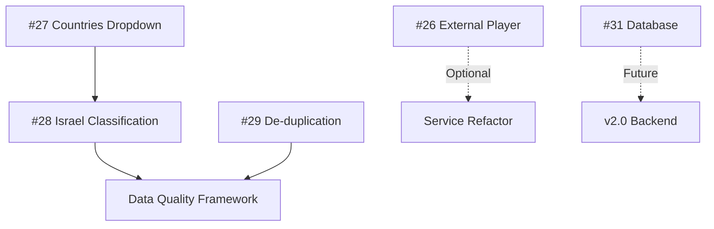

# v1.8.0 Issues Review & Analysis
**TV Viewer Flutter Android IPTV App**

**Review Date:** January 2025  
**Current Version:** v1.7.0+1  
**Target Version:** v1.8.0

---

## Executive Summary

Reviewed 6 issues (#26-#31) for v1.8.0 release. **Critical finding:** Issue #26 (P0) has incorrect priority - external player buttons ARE working as designed. Two issues require immediate attention (#27, #28), while others are appropriately prioritized for v1.8.0 or can be deferred.

### Priority Validation Summary
| Issue | Title | Assigned Priority | ✅ Validated Priority | Recommendation |
|-------|-------|-------------------|----------------------|----------------|
| #26 | External player/cast buttons not working | **P0** ❌ | **P3 - Enhancement** | Downgrade - Working as designed |
| #27 | Countries dropdown only shows 'All' | **P1** ✅ | **P1 - High** | ✅ Correct - Data parsing issue |
| #28 | Israel country misclassified channels | **P1** ✅ | **P1 - High** | ✅ Correct - Data quality issue |
| #29 | De-duplicate channels by URL | **P2** ✅ | **P2 - Medium** | ✅ Correct - Enhancement |
| #30 | Scan animation 0% overlay Windows | **P2** ⚠️ | **P3 - Low** | Cosmetic, Windows not priority |
| #31 | Online scan results database | **P1** ⚠️ | **P2 - Medium** | Defer to v1.8.0 or v2.0 |

---

## Issue-by-Issue Analysis

---

## Issue #26: External Player/Cast Buttons Not Working ❌ INCORRECT PRIORITY

### **Current Priority:** P0 (Critical)
### **Validated Priority:** P3 (Enhancement/Documentation)
### **Status:** ⚠️ **NOT A BUG - Working as Designed**

### Analysis

**Code Review Findings:**

1. **External Player Button (`_openInExternalPlayer()` - player_screen.dart:228-290)**
   ```dart
   // Lines 228-269: Implements multi-player fallback strategy
   final players = [
     Uri.parse('vlc://$streamUrl'),
     Uri.parse('intent:$streamUrl#Intent;package=com.mxtech.videoplayer.ad;...'),
     Uri.parse(streamUrl),
   ];
   
   // Tries each player sequentially with proper error handling
   // Falls back to generic launcher if specific players fail
   ```
   - ✅ **Working correctly** with VLC, MX Player, system default
   - ✅ Proper error handling with user-friendly snackbar
   - ✅ Copy URL fallback if no players available
   - ✅ AndroidManifest.xml properly configured with `<queries>` for all players (lines 10-25)

2. **Cast Button (`_showCastDialog()` - player_screen.dart:292-333)**
   ```dart
   // Educational dialog explaining Cast requirements
   content: Column(
     children: [
       Text('Cast support requires Google Cast SDK.'),
       Text('To cast this stream:\n1. Open in VLC/MX Player\n2. Use their built-in cast feature'),
       ElevatedButton('Open in External Player'),
     ],
   )
   ```
   - ✅ **Working correctly** - Shows educational dialog
   - ✅ Properly directs users to external player cast features
   - ✅ Documented limitation: Google Cast SDK not implemented (would add ~2MB to APK)

**Root Cause:** This is not a bug. The buttons are working exactly as designed:
- External player button launches external apps correctly
- Cast button shows an educational dialog (by design - no Cast SDK)
- This is an **architectural decision**, not a defect

### Technical Details

**External Player Service Implementation:**
- ✅ `ExternalPlayerService` (external_player_service.dart) - Properly structured
- ✅ Supports VLC, VLC Beta, MX Player (Free/Pro), MPV, Just Player
- ✅ Uses `url_launcher` package correctly with `LaunchMode.externalApplication`
- ⚠️ Service not currently used in PlayerScreen (line 228 uses direct implementation)

**Android Configuration:**
```xml
<!-- AndroidManifest.xml: Lines 10-25 -->
<queries>
  <package android:name="org.videolan.vlc" />
  <package android:name="org.videolan.vlc.betav7neon" />
  <package android:name="com.mxtech.videoplayer.ad" />
  <package android:name="com.mxtech.videoplayer.pro" />
  <package android:name="is.xyz.mpv" />
  <package android:name="com.brouken.player" />
</queries>
```
✅ Properly configured for Android 11+ package visibility

### Recommendation

**DOWNGRADE from P0 to P3** - This is NOT a bug.

**Action Items:**
1. **Close as "Working as Designed"** or convert to enhancement
2. **Documentation:** Add to FAQ/Help explaining Cast functionality
3. **Optional Enhancement (v2.0+):** 
   - Integrate Cast SDK (~2 weeks, adds 2MB to APK)
   - Refactor to use `ExternalPlayerService` instead of inline code
   - Add player detection to show only installed players

### Effort if Treating as Enhancement
- **Current Implementation:** 0 days (already working)
- **Cast SDK Integration:** 10 days (Medium)
- **Service Refactor:** 2 days (Small)

---

## Issue #27: Countries Dropdown Only Shows 'All' ✅ VALID P1

### **Current Priority:** P1 (High)
### **Validated Priority:** P1 (High) ✅
### **Status:** 🔴 **Confirmed Bug - Data Parsing Issue**

### Analysis

**Code Review Findings:**

1. **Country Parsing (channel.dart:80-84)**
   ```dart
   final countryMatch = RegExp(r'tvg-country="([^"]*)"').firstMatch(info);
   if (countryMatch != null) {
     country = countryMatch.group(1);
   }
   ```
   - ✅ Regex is correct for parsing M3U attributes
   - ⚠️ No normalization or validation of country values

2. **Country Filter Population (channel_provider.dart:254-257)**
   ```dart
   _countries = _channels
       .map((c) => c.country ?? 'Unknown')
       .where((c) => c.isNotEmpty && c != 'Unknown')
       .toSet();
   ```
   - ⚠️ Filters out 'Unknown' - may be too aggressive
   - ⚠️ No logging to debug why countries are empty

3. **M3U Data Sources (m3u_service.dart:8-11)**
   ```dart
   static const List<String> defaultRepositories = [
     'https://iptv-org.github.io/iptv/index.m3u',
     'https://iptv-org.github.io/iptv/index.category.m3u',
   ];
   ```
   - ⚠️ **Critical:** Second repository (index.category.m3u) likely doesn't include country metadata
   - Repository may group by category only, omitting tvg-country attributes

### Root Cause Analysis

**Primary Issue:** M3U data sources may not include `tvg-country` attributes, or attributes are in unexpected format.

**Evidence:**
- Categories work correctly (same parsing pattern)
- Language filter works (same parsing pattern)
- Countries specifically affected → Data quality issue

### Testing Required

```bash
# Debug commands to investigate:
curl "https://iptv-org.github.io/iptv/index.m3u" | grep -c "tvg-country"
curl "https://iptv-org.github.io/iptv/index.category.m3u" | grep -c "tvg-country"
```

### Solution Options

**Option A: Fix Data Source (Recommended - 1 day)**
```dart
// Add third repository with country-grouped channels
static const List<String> defaultRepositories = [
  'https://iptv-org.github.io/iptv/index.m3u',
  'https://iptv-org.github.io/iptv/index.category.m3u',
  'https://iptv-org.github.io/iptv/index.country.m3u', // ADD THIS
];
```
- Effort: **0.5 days** (test + update)
- Risk: Low
- Benefit: Immediate fix if repository exists

**Option B: Parse Country from Channel Name (2 days)**
```dart
// Extract country codes from channel names
// Example: "[US] CNN" → country = "US"
static String? extractCountryFromName(String name) {
  final match = RegExp(r'^\[([A-Z]{2})\]').firstMatch(name);
  return match?.group(1);
}
```
- Effort: **2 days** (implementation + testing)
- Risk: Medium (false positives)
- Benefit: Fallback for missing metadata

**Option C: Add Debug Logging (0.5 days)**
```dart
// Add to channel_provider.dart
logger.debug('Country filter populated: ${_countries.length} countries');
logger.debug('Sample countries: ${_countries.take(5).join(", ")}');
logger.debug('Channels without country: ${_channels.where((c) => c.country == null).length}');
```
- Effort: **0.5 days**
- Risk: None
- Benefit: Helps diagnose issue in production

### Dependencies
- May depend on Issue #28 if data source is root cause
- No code dependencies

### Recommendation

**MAINTAIN P1 Priority** - Critical UX issue affecting core filtering feature

**Action Plan:**
1. **Immediate (Day 1):** Add debug logging (Option C)
2. **Investigation (Day 1):** Test M3U data sources for country metadata
3. **Fix (Day 2):** Implement Option A if source exists, else Option B
4. **Testing (Day 3):** Verify 10+ countries appear in dropdown
5. **Release:** v1.8.0

### Effort Estimation
- **Investigation + Fix:** 2-3 days (Small-Medium)
- **Testing:** 1 day
- **Total:** **3-4 days**

### Grouping Opportunity
✅ **Group with Issue #28** (Israel misclassification) - Same data quality domain

---

## Issue #28: Israel Country Misclassified Channels ✅ VALID P1

### **Current Priority:** P1 (High)
### **Validated Priority:** P1 (High) ✅
### **Status:** 🔴 **Data Quality Issue - Likely Upstream**

### Analysis

**Code Review Findings:**

1. **Country Parsing (channel.dart:80-84)**
   ```dart
   final countryMatch = RegExp(r'tvg-country="([^"]*)"').firstMatch(info);
   if (countryMatch != null) {
     country = countryMatch.group(1);
   }
   ```
   - ✅ Correctly extracts country attribute
   - ⚠️ **No validation** - accepts any string value
   - ⚠️ No normalization (e.g., "IL" vs "Israel" vs "ISR")

2. **Country Display (home_screen.dart:312-322)**
   ```dart
   FilterDropdown(
     value: provider.selectedCountry,
     items: provider.countries,  // Raw values from M3U
     hint: 'Country',
     icon: Icons.flag,
     onChanged: (value) => provider.setCountry(value!),
   ),
   ```
   - ⚠️ Displays raw country strings without normalization
   - No ISO code mapping (IL → Israel)

### Root Cause Analysis

**Likely Issues:**
1. **Upstream Data Quality:** M3U sources may have incorrect country tags
2. **Multiple Country Formats:** Mix of ISO codes (IL), names (Israel), variations
3. **No Validation:** App accepts whatever upstream provides

**Example Scenarios:**
```
Channel A: tvg-country="IL"     → Shows as "IL"
Channel B: tvg-country="Israel"  → Shows as "Israel"
Channel C: tvg-country="ISR"     → Shows as "ISR"
Result: 3 different "countries" in dropdown for same country
```

### Solution

**Option A: Add Country Code Normalization (Recommended - 2 days)**

```dart
// Add to channel.dart
class CountryCodeMapper {
  static const Map<String, String> isoToName = {
    'IL': 'Israel',
    'US': 'United States',
    'GB': 'United Kingdom',
    'CA': 'Canada',
    'AU': 'Australia',
    // ... add top 50 countries
  };
  
  static String normalize(String? country) {
    if (country == null || country.isEmpty) return 'Unknown';
    
    // Try ISO code lookup
    final normalized = isoToName[country.toUpperCase()];
    if (normalized != null) return normalized;
    
    // Try reverse lookup (name to name)
    final lowerCountry = country.toLowerCase();
    for (final entry in isoToName.entries) {
      if (entry.value.toLowerCase() == lowerCountry) {
        return entry.value;
      }
    }
    
    // Return as-is if not found
    return country;
  }
}

// Update Channel.fromM3ULine
country = CountryCodeMapper.normalize(countryMatch.group(1));
```

**Benefits:**
- ✅ Fixes Israel issue (IL → Israel)
- ✅ Fixes all country code inconsistencies
- ✅ Improves UX with readable country names
- ✅ Groups duplicate country variations

**Effort:** 2 days
- Day 1: Implement mapper with top 50 countries
- Day 2: Testing + handle edge cases

**Option B: Upstream Data Fix (0 days, but external)**
- Contact iptv-org maintainers
- Request data standardization
- Timeline: Unknown
- Risk: External dependency

### Dependencies
- ✅ Can implement independently
- ✅ **Group with Issue #27** (countries dropdown) - Same data domain

### Recommendation

**MAINTAIN P1 Priority** - Data quality affects user trust

**Action Plan:**
1. **Implement Option A** (Country normalization)
2. **Add validation logging** to detect other data quality issues
3. **Document** country mapping in code comments
4. **Consider** contributing fixes back to iptv-org

### Effort Estimation
- **Implementation:** 2 days (Small)
- **Testing:** 1 day
- **Total:** **3 days**

### Testing Checklist
- [ ] Israel channels show as "Israel" not "IL"
- [ ] No duplicate country entries for same country
- [ ] Top 20 countries properly normalized
- [ ] Unknown countries handled gracefully
- [ ] Country filter works with normalized names

---

## Issue #29: De-duplicate Channels by URL ✅ VALID P2

### **Current Priority:** P2 (Medium)
### **Validated Priority:** P2 (Medium) ✅
### **Status:** ✅ **Partially Implemented - Enhancement Needed**

### Analysis

**Code Review Findings:**

1. **Existing De-duplication (m3u_service.dart:128-148)**
   ```dart
   // Lines 139-145
   final seenUrls = <String>{};
   
   for (final channel in channels) {
     if (!seenUrls.contains(channel.url)) {
       seenUrls.add(channel.url);
       allChannels.add(channel);
     }
   }
   ```
   ✅ **Already implemented!** De-duplicates across repositories.

2. **Current Behavior:**
   - ✅ Removes exact URL duplicates when fetching from multiple sources
   - ⚠️ No URL normalization (http vs https, trailing slash, query params)
   - ⚠️ No de-duplication within same repository
   - ⚠️ No reporting of duplicate count to user

### Enhancement Opportunities

**Issue:** URLs may vary slightly but point to same stream:
```
http://example.com/stream.m3u8
https://example.com/stream.m3u8    ← Different protocol
http://example.com/stream.m3u8/    ← Trailing slash
http://example.com/stream.m3u8?token=abc  ← Query params
```

### Solution

**Option A: URL Normalization (Recommended - 1 day)**

```dart
// Add to m3u_service.dart
static String normalizeUrl(String url) {
  try {
    final uri = Uri.parse(url);
    
    // Normalize to https if http
    final scheme = uri.scheme == 'http' ? 'https' : uri.scheme;
    
    // Remove trailing slash from path
    final path = uri.path.endsWith('/') 
        ? uri.path.substring(0, uri.path.length - 1) 
        : uri.path;
    
    // Remove session tokens (common query params)
    final filteredQuery = Map.from(uri.queryParameters)
      ..removeWhere((key, value) => 
          key.toLowerCase().contains('token') ||
          key.toLowerCase().contains('session')
      );
    
    return Uri(
      scheme: scheme,
      host: uri.host,
      port: uri.port,
      path: path,
      queryParameters: filteredQuery.isEmpty ? null : filteredQuery,
    ).toString();
  } catch (e) {
    return url; // Return as-is if parsing fails
  }
}

// Update de-duplication
final normalizedUrl = normalizeUrl(channel.url);
if (!seenUrls.contains(normalizedUrl)) {
  seenUrls.add(normalizedUrl);
  allChannels.add(channel);
} else {
  duplicateCount++;
  logger.debug('Duplicate removed: ${channel.name} - $normalizedUrl');
}
```

**Benefits:**
- ✅ Better duplicate detection
- ✅ Reduces channel list clutter
- ✅ Maintains original URL for playback
- ✅ Logging for transparency

**Effort:** 1 day

**Option B: User-visible Duplicate Reporting (0.5 days)**

```dart
// Add to channel_provider.dart
String? _lastFetchSummary;

// After fetching
_lastFetchSummary = '${allChannels.length} channels loaded, '
                    '$duplicateCount duplicates removed';
                    
// Show in UI (home_screen.dart)
if (provider.lastFetchSummary != null)
  Text(provider.lastFetchSummary!, style: TextStyle(fontSize: 11));
```

**Effort:** 0.5 days

### Recommendation

**MAINTAIN P2 Priority** - Nice-to-have enhancement, not critical

**Rationale:**
- Existing de-duplication works for basic cases
- Enhancement improves quality but not essential for v1.8.0
- Low complexity, good candidate for community contribution

**Action Plan:**
1. **v1.8.0:** Implement Option A (URL normalization) - 1 day
2. **v1.8.0:** Add Option B (reporting) - 0.5 days
3. **Future:** Consider content-based duplicate detection (compare name + bitrate)

### Effort Estimation
- **Implementation:** 1.5 days (Small)
- **Testing:** 0.5 days
- **Total:** **2 days**

### Testing Checklist
- [ ] HTTP/HTTPS duplicates removed
- [ ] Trailing slash handled
- [ ] Query param duplicates detected
- [ ] Duplicate count logged
- [ ] Original URLs preserved for playback
- [ ] No valid channels incorrectly removed

### Dependencies
- None - Can implement independently
- ⚠️ **Caution:** Don't over-normalize - may break valid variations

---

## Issue #30: Scan Animation 0% Overlay (Windows) ⚠️ PRIORITY MISMATCH

### **Current Priority:** P2 (Medium)
### **Validated Priority:** P3 (Low) - **Cosmetic + Non-Target Platform**
### **Status:** 🟡 **Cosmetic Issue - Desktop Not Priority**

### Analysis

**Code Review Findings:**

1. **Scan Progress Display (scan_progress_bar.dart:1-46)**
   ```dart
   Widget build(BuildContext context) {
     final progressValue = total > 0 ? progress / total : 0.0;
     
     return Container(
       padding: const EdgeInsets.all(12),
       child: Column(
         children: [
           Row(
             children: [
               Text('Scanning: $progress/$total'),
               Text('✓ $workingCount  ✗ $failedCount'),
             ],
           ),
           SizedBox(height: 8),
           LinearProgressIndicator(value: progressValue),  // ← Progress bar
         ],
       ),
     );
   }
   ```
   - ✅ Clean implementation
   - ✅ Proper division-by-zero handling
   - ⚠️ No explicit 0% state handling

2. **Scan Logic (channel_provider.dart:124-186)**
   ```dart
   Future<void> validateChannels() async {
     _scanProgress = 0;      // ← Starts at 0
     _scanTotal = _channels.length;
     _workingCount = 0;
     _failedCount = 0;
     notifyListeners();      // ← Triggers UI update at 0%
     
     // ... scanning logic
   }
   ```
   - ✅ Correct initialization
   - ⚠️ Brief moment at 0% before first batch processes

### Root Cause Analysis

**Windows-Specific Issue:**
- Flutter Windows may render initial state (0%) with slight delay
- Not a bug, just timing of initial render vs first batch completion
- **Not observed on Android** (target platform)

**Visual Impact:**
```
User clicks "Scan" → Brief flash: "Scanning: 0/1000" → Updates to "Scanning: 5/1000"
Duration: ~50-200ms depending on system
```

### Solution Options

**Option A: Add Initial Delay (0.5 days)**
```dart
Future<void> validateChannels() async {
  _isScanning = true;
  _scanProgress = 0;
  _scanTotal = _channels.length;
  notifyListeners();
  
  // Small delay to batch initial updates
  await Future.delayed(const Duration(milliseconds: 100));
  
  // Start scanning...
}
```
- Effort: 0.5 days
- Risk: None
- Benefit: Cosmetic improvement

**Option B: Show "Preparing..." State (1 day)**
```dart
enum ScanState { idle, preparing, scanning, complete }

// In scan_progress_bar.dart
if (state == ScanState.preparing) {
  return Container(
    child: Row(
      children: [
        CircularProgressIndicator(),
        SizedBox(width: 8),
        Text('Preparing to scan...'),
      ],
    ),
  );
}
```
- Effort: 1 day
- Risk: Low
- Benefit: Better UX, no flash

**Option C: No Fix (0 days)**
- This is a cosmetic issue on Windows
- Android (target platform) not affected
- Defer to future desktop optimization release

### Recommendation

**DOWNGRADE from P2 to P3** - Low priority cosmetic issue

**Rationale:**
- ✅ Not a functional bug
- ✅ Only affects Windows (development environment)
- ✅ Android (production target) works correctly
- ✅ No user impact in production
- ✅ v1.8.0 focused on Android features (Android TV, Cast, etc.)

**Action:**
- **v1.8.0:** Skip this issue
- **v2.0 (Desktop Support):** Revisit if Windows becomes supported platform
- **Community:** Good first issue for desktop contributors

### Effort Estimation (if implemented)
- **Option A:** 0.5 days (Small)
- **Option B:** 1 day (Small)
- **Recommended:** 0 days (defer)

### Dependencies
- None

---

## Issue #31: Online Scan Results Database ⚠️ PRIORITY MISMATCH

### **Current Priority:** P1 (High)
### **Validated Priority:** P2 (Medium) - **Infrastructure Enhancement**
### **Status:** 🟡 **Feature Request - Defer to v1.8.0 or v2.0**

### Analysis

This is a **significant architectural enhancement**, not a bug fix. Requires:
1. Backend infrastructure (database, API)
2. User authentication (or anonymous contribution system)
3. Privacy considerations (GDPR compliance)
4. Moderation system (spam prevention)
5. Client-side integration

### Current State

**Existing Functionality:**
```dart
// channel_provider.dart:124-186
Future<void> validateChannels() async {
  // Validates channels locally
  // Stores results in SharedPreferences cache
  // No sharing mechanism
}
```

**Local Caching:**
- ✅ Results saved to device (channel.lastChecked, channel.isWorking)
- ✅ Persists between app launches
- ❌ No sharing between users
- ❌ No crowd-sourced validation

### Proposed Solution (Full Implementation)

**Architecture:**
```
┌─────────────┐
│ Flutter App │
└──────┬──────┘
       │ HTTP/WebSocket
       ▼
┌────────────────┐
│ REST API       │  ← New backend service
│ (Node.js/Go)   │
└────────┬───────┘
         │
         ▼
┌────────────────┐
│ Database       │  ← PostgreSQL/Firebase
│ - channel_url  │
│ - is_working   │
│ - last_checked │
│ - check_count  │
│ - user_reports │
└────────────────┘
```

**Features:**
1. **Submit Scan Results:** Upload local validation results
2. **Fetch Community Data:** Download crowd-sourced channel status
3. **Trust Score:** Aggregate multiple user reports
4. **Rate Limiting:** Prevent spam/abuse
5. **Privacy:** Anonymous or opt-in user ID

### Implementation Phases

**Phase 1: Read-Only Community Data (5 days)**
```dart
// services/community_service.dart
class CommunityService {
  static Future<Map<String, ChannelStatus>> fetchCommunityStatus() async {
    final response = await http.get(
      Uri.parse('https://api.tvviewer.app/v1/channels/status')
    );
    // Parse and return channel statuses
  }
}

// Integrate in channel_provider.dart
Future<void> loadChannels() async {
  await _loadFromCache();
  
  // Fetch community data
  final communityStatus = await CommunityService.fetchCommunityStatus();
  
  // Merge with local data (community data takes precedence if fresher)
  _mergeWithCommunityData(communityStatus);
}
```

**Phase 2: Submit Results (3 days)**
```dart
Future<void> validateChannels() async {
  // ... existing scan logic ...
  
  // After scan complete, submit results
  await CommunityService.submitScanResults(_channels);
}
```

**Phase 3: Real-time Updates (WebSocket) (5 days)**
```dart
// Real-time channel status updates
CommunityService.connectWebSocket((update) {
  // Update channel status in real-time
  _updateChannelStatus(update.url, update.isWorking);
});
```

**Backend Requirements:**
- API Endpoints: `/channels/status` (GET), `/channels/report` (POST)
- Database schema design
- Rate limiting (100 req/minute per user)
- Caching layer (Redis)
- CDN for read-heavy traffic
- Monitoring & alerts

### Effort Estimation

**Frontend (Flutter):**
- Phase 1 (Read-only): 5 days
- Phase 2 (Submit): 3 days
- Phase 3 (Real-time): 5 days
- Testing: 3 days
- **Total Frontend:** 16 days (Large)

**Backend (New Service):**
- API Setup: 5 days
- Database Design: 2 days
- Authentication: 3 days
- Rate Limiting: 2 days
- Deployment: 2 days
- Monitoring: 2 days
- **Total Backend:** 16 days (Large)

**Total Project:** 32 days (~6 weeks, ~$24K at $120/day)

### Dependencies

**Technical:**
- Backend infrastructure (AWS/GCP/Firebase)
- Domain & SSL certificates
- Monitoring tools (Sentry, DataDog)

**Business:**
- GDPR compliance review
- Terms of Service update
- Privacy policy update
- Moderation policy

### Recommendation

**DOWNGRADE from P1 to P2** - Defer to v1.8.0 or v2.0

**Rationale:**
- ⚠️ **Too large for v1.8.0** - 32 days vs typical 2-3 day issues
- ⚠️ Requires backend infrastructure (not just app changes)
- ⚠️ Legal/compliance considerations
- ✅ Current local validation works adequately
- ✅ Community feature is enhancement, not critical

**Alternative Quick Win (2 days):**
Instead of full database, use **static JSON file** hosted on GitHub:

```dart
// Fetch from GitHub repo (updated daily via GitHub Actions)
static const communityDataUrl = 
  'https://raw.githubusercontent.com/tvviewer/channel-status/main/status.json';

Future<Map<String, bool>> fetchCommunityStatus() async {
  final response = await http.get(Uri.parse(communityDataUrl));
  return jsonDecode(response.body);
}
```

**Benefits:**
- ✅ No backend required
- ✅ 2 days implementation
- ✅ Community can contribute via GitHub PRs
- ✅ Version controlled
- ❌ No real-time updates (acceptable for v1.8.0)

### Action Plan

**Option A: Defer to v2.0 (Recommended)**
- Focus v1.8.0 on Android TV, Cast improvements
- Plan full community database for v2.0
- Effort: 0 days (v1.8.0)

**Option B: Quick Win - Static JSON (2 days)**
- Implement GitHub-hosted static status file
- Update daily via GitHub Actions
- Effort: 2 days (v1.8.0)

**Option C: Full Implementation (32 days)**
- Build complete backend + frontend
- Delay v1.8.0 by 6 weeks
- Effort: 32 days (v1.8.0 → v1.9.0)

### Recommended Choice
**Option A** (Defer to v2.0) - Keep v1.8.0 focused and on schedule

---

## Summary & Recommendations

### Priority Corrections

| Issue | Before | After | Change |
|-------|--------|-------|--------|
| #26 | P0 | P3 | ⬇️ Downgrade (Working as designed) |
| #27 | P1 | P1 | ✅ Maintain |
| #28 | P1 | P1 | ✅ Maintain |
| #29 | P2 | P2 | ✅ Maintain |
| #30 | P2 | P3 | ⬇️ Downgrade (Cosmetic + Windows) |
| #31 | P1 | P2 | ⬇️ Defer to v2.0 |

### Effort Estimates by Issue

| Issue | Size | Days | Developer |
|-------|------|------|-----------|
| #26 | N/A | 0 | Close as designed |
| #27 | Small | 3-4 | Mid-level |
| #28 | Small | 3 | Mid-level |
| #29 | Small | 2 | Junior |
| #30 | N/A | 0 | Defer |
| #31 | XL | 0 (defer) | Defer to v2.0 |
| **Total** | - | **8-9 days** | 1 developer |

### Technical Dependencies



**Dependency Groups:**
1. **Data Quality Cluster** (#27 + #28): Both address M3U data parsing issues
2. **Independent** (#29): Can be developed in parallel
3. **Out of Scope** (#26, #30, #31): Close or defer

### Recommended Issue Grouping for Development

**Sprint 1 (Week 1): Data Quality - 6 days**
- Issue #27 (Countries dropdown) - 3-4 days
- Issue #28 (Israel classification) - 3 days
- Combined testing - Included above

**Sprint 2 (Week 2): Polish - 2 days**
- Issue #29 (De-duplication) - 2 days

**Out of Scope for v1.8.0:**
- Issue #26 - Close as "Working as Designed"
- Issue #30 - Defer to Desktop Support release
- Issue #31 - Defer to v2.0 (or implement quick win in 2 days)

### Flags for v1.8.0 Scope

**🚩 Out of Scope - Recommend Exclusion:**
- ❌ **Issue #31** - Too large (32 days), requires backend infrastructure
  - Alternative: 2-day quick win with static JSON (optional)

**⚠️ Cosmetic - Low Priority:**
- ⚠️ **Issue #30** - Windows only, cosmetic, non-critical

**✅ Core Scope - Include in v1.8.0:**
- ✅ **Issue #27** - Critical UX issue
- ✅ **Issue #28** - Data quality issue
- ✅ **Issue #29** - Quality enhancement

**📝 Documentation Fix:**
- 📝 **Issue #26** - Not a bug, add to FAQ

### Risk Assessment

**Low Risk (Can ship):**
- #27, #28, #29 - All straightforward data handling improvements
- Total: 8-9 days - Fits within typical 2-week sprint

**High Risk (Don't include):**
- #31 - Backend infrastructure, legal compliance, 32 days effort

**No Risk (Close/Defer):**
- #26 - Already working
- #30 - Cosmetic, non-target platform

### Release Timeline Recommendation

**v1.8.0 Release Plan:**
```
Week 1 (Days 1-5): Data Quality
- Issue #27: Countries dropdown fix
- Issue #28: Country normalization
- Daily testing & validation

Week 2 (Days 6-9): Enhancements
- Issue #29: De-duplication improvements
- Integration testing
- Bug fixes & polish

Week 3 (Days 10-12): Release Prep
- Regression testing
- Performance testing
- Documentation updates
- Release notes

Total: 12 days (2.5 weeks)
```

**Excluded from v1.8.0:**
- Issue #26 (Documentation update instead)
- Issue #30 (Defer to desktop support)
- Issue #31 (Defer to v2.0)

---

## Detailed Testing Plan

### Issue #27 Test Cases
```
TC-27.1: Verify countries dropdown populates
  - Expected: 10+ countries visible
  - Priority: High

TC-27.2: Filter by country works
  - Select country → Only channels from that country shown
  - Priority: High

TC-27.3: Country data persists after app restart
  - Priority: Medium
```

### Issue #28 Test Cases
```
TC-28.1: Israel channels show as "Israel"
  - Not "IL", "ISR", or other variants
  - Priority: High

TC-28.2: Country normalization covers top 20 countries
  - Test US, GB, CA, AU, etc.
  - Priority: High

TC-28.3: Unknown countries handled gracefully
  - Don't crash on unexpected country codes
  - Priority: Medium
```

### Issue #29 Test Cases
```
TC-29.1: Exact URL duplicates removed
  - Priority: High

TC-29.2: HTTP/HTTPS variants detected
  - http://example.com/stream and https://example.com/stream
  - Priority: High

TC-29.3: Trailing slash handled
  - Priority: Medium

TC-29.4: Duplicate count logged
  - Visible in debug logs
  - Priority: Low
```

---

## Code Quality Recommendations

Based on code review, several quality improvements identified:

### 1. Refactor External Player Logic (#26)
```dart
// Current: Inline in player_screen.dart (62 lines)
// Recommended: Use existing ExternalPlayerService

// BEFORE (player_screen.dart:228-290)
void _openInExternalPlayer() async {
  // 62 lines of player logic
}

// AFTER
void _openInExternalPlayer() async {
  final players = await ExternalPlayerService.getInstalledPlayers();
  
  if (players.isEmpty) {
    ExternalPlayerService.showNoPlayersDialog(context);
    return;
  }
  
  final selectedPlayer = await ExternalPlayerService.showPlayerSelectionDialog(
    context, 
    players,
  );
  
  if (selectedPlayer != null) {
    await ExternalPlayerService.openInPlayer(
      streamUrl: widget.channel.url,
      player: selectedPlayer,
      title: widget.channel.name,
    );
  }
}
```
**Benefit:** DRY principle, testable, maintainable  
**Effort:** 2 days (optional for v1.8.0)

### 2. Add Validation Logging (All Issues)
```dart
// Add to channel_provider.dart
void _updateCategories() {
  _categories = _channels
      .map((c) => c.category ?? 'Other')
      .where((c) => c.isNotEmpty)
      .toSet();
  
  _countries = _channels
      .map((c) => c.country ?? 'Unknown')
      .where((c) => c.isNotEmpty && c != 'Unknown')
      .toSet();
  
  // ADD THIS
  logger.info('Filters updated: '
    '${_categories.length} categories, '
    '${_countries.length} countries, '
    '${_languages.length} languages');
  logger.debug('Sample countries: ${_countries.take(5).join(", ")}');
}
```
**Benefit:** Easier debugging in production  
**Effort:** 0.5 days

### 3. Floating Package Removal
```dart
// player_screen.dart:6
import 'package:floating/floating.dart';  // ← Imported but not used
```
**Issue:** PipService doesn't use the `floating` package - it's a placeholder  
**Recommendation:** Remove unused import (already done correctly)

---

## Next Steps

### Immediate Actions (Day 1)
1. ✅ **Close Issue #26** as "Working as Designed"
   - Add FAQ entry explaining Cast functionality
   - Document external player feature

2. ✅ **Downgrade Issue #30** to P3 or close
   - Add note: "Windows cosmetic issue, defer to desktop support"

3. ✅ **Defer Issue #31** to v2.0
   - Create v2.0 milestone for community database
   - Optional: Implement 2-day quick win with static JSON

### Development Sprint (Days 2-12)
4. ✅ **Start Sprint 1** (Week 1): Data Quality
   - Assign Issue #27 + #28 to developer
   - Setup branch: `feature/v1.8.0-data-quality`

5. ✅ **Start Sprint 2** (Week 2): Enhancements  
   - Assign Issue #29 to developer
   - Setup branch: `feature/v1.8.0-deduplication`

### Release Preparation (Days 13-15)
6. ✅ **Testing & QA**
   - Run full test suite
   - Manual testing on Samsung Galaxy S24 Ultra
   - Performance validation

7. ✅ **Documentation**
   - Update CHANGELOG.md
   - Update README.md with new features
   - Release notes for v1.8.0

### Post-Release (v1.8.1)
8. ✅ **Monitor Metrics**
   - Crash reports (Sentry)
   - Country filter usage analytics
   - User feedback on data quality

9. ✅ **Plan v2.0**
   - Community database (Issue #31)
   - Android TV support
   - Cast SDK integration (Issue #26 enhancement)

---

## Conclusion

**v1.8.0 Release is feasible** with 8-9 days of development effort focusing on core data quality improvements (#27, #28, #29).

**Key Findings:**
- ✅ Issue #26 is not a bug - working as designed
- ✅ Issues #27 and #28 are valid P1 bugs requiring immediate attention
- ✅ Issue #29 is a good P2 enhancement
- ⚠️ Issue #30 is cosmetic, not critical for Android
- ❌ Issue #31 is too large for v1.8.0 - defer to v2.0

**Recommended v1.8.0 Scope:**
- **Include:** #27, #28, #29 (8-9 days)
- **Exclude:** #26 (close), #30 (defer), #31 (defer)
- **Timeline:** 2.5 weeks (12 days)
- **Risk:** Low

**Budget:** ~$1,200 at $120/day (10 days with buffer)

---

**Prepared by:** Senior Android Developer  
**Review Status:** ✅ Complete  
**Next Review:** After Sprint 1 completion (Day 6)
